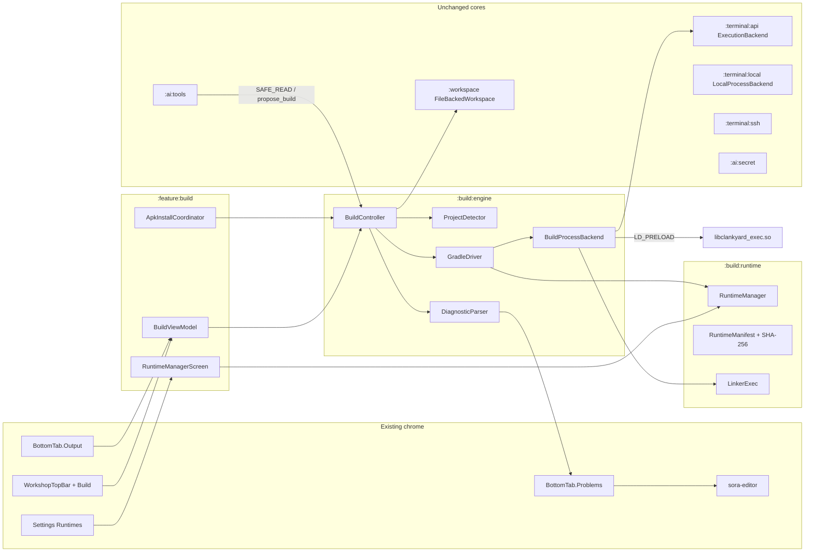
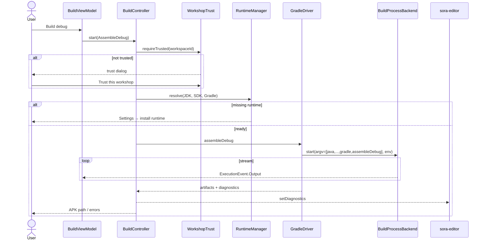
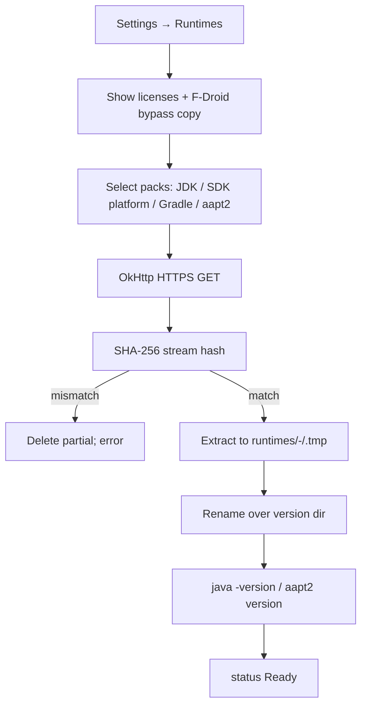
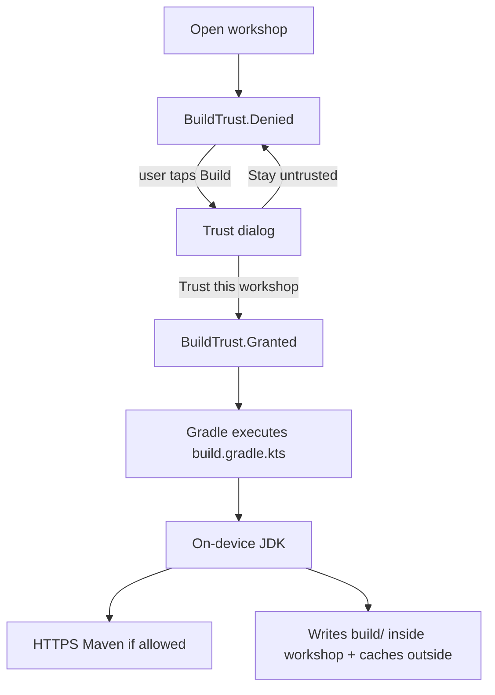

# On-Device BUILD Subsystem for Clankyard

| Field | Value |
| --- | --- |
| **Title** | On-Device BUILD Subsystem for Clankyard |
| **Author** | Clankyard contributors |
| **Date** | 2026-09-24 |
| **Status** | Draft |
| **Tip inspected** | current `main` at `/home/antona89/Documenti/vscode/clankyard` |
| **License of this design** | MIT (same as Clankyard source) |

Evidence labels used throughout:

- **CONFIRMED** — read from current Clankyard source, or from a primary upstream doc/repo cited in-place.
- **LIKELY** — strong public evidence, not yet reproduced in this tree.
- **EXPERIMENTAL** — reported working in a fork/lab, needs a Clankyard POC before committing the architecture.
- **BLOCKED** — license, policy, or platform constraint forbids the approach as described.

---

## Overview

Clankyard is already a native Android workshop: file-backed projects, sora-editor, local Git, a sandbox shell, optional SSH, and a Clanker that proposes patches for humans to accept. It cannot yet compile a user Android/Kotlin project on the device. This design adds a first-class **BUILD** subsystem that installs an optional on-device Android/Kotlin toolchain (JDK + SDK pieces + Gradle), detects a real Gradle Android project in the open workshop, runs `assembleDebug` locally, streams output, parses diagnostics into the existing editor, and returns an APK the human can export or install through the system installer UI.

It does **not** redesign Clankyard. It does **not** replace `:terminal:*`, `:workspace`, Git, the Clanker, or the editor. It extends the existing `ExecutionBackend` process contract, ships an MIT `LD_PRELOAD` exec interceptor so Gradle/AGP grandchildren can run filesDir ELFs, parks toolchains **outside** workshop trees, and keeps the Clanker philosophy: AI proposes, humans approve. No arbitrary shell for the LLM. No silent APK install. No auto-commit of build artifacts. No root. No Termux. No cloud compiler. No mandatory Clankyard backend. The relocatable Bionic JDK is a **separate tools-repo track** that must publish a zip+SHA-256 before the app downloads it.

**HOST Gradle** (desktop JDK 17 building Clankyard itself: AGP 9.4.0, Gradle 9.6.0, Kotlin 2.4.20) is a different universe from **ON-DEVICE Gradle** (a Bionic-linked JDK subprocess building the *user's* project). Mixing the two is a design bug. This document never uses Clankyard's host versions as the on-device default.

---

## Background & Motivation

### Current state (CONFIRMED)

Clankyard today:

- Native Kotlin, Jetpack Compose / Material 3, single `MainActivity`, Navigation 2, Hilt + KSP, UDF (`docs/architecture.md`, `app/src/main/kotlin/dev/clankyard/app/MainActivity.kt`).
- `minSdk 29`, `compileSdk 36`, `targetSdk 36`, JDK 17 for **host** builds (`gradle/libs.versions.toml`, `app/build.gradle.kts`).
- Workshops live under `filesDir/environment/workspaces/` after a one-time migration from `filesDir/workspaces/` (`WorkshopEnvironment.kt`). SAF is copy-in, not a live `DocumentFile` tree (`AndroidWorkspaceIo.kt`).
- Local execution is `/system/bin/sh` via `ProcessBuilder` (`LocalProcessBackend.kt`). `canExecUserBinaries = false`. PATH is system bins only. Banner: this is not a Linux distro.
- Optional SSH via Apache MINA SSHD (`SshExecutionBackend.kt`) already exists and **stays**. SSH is not this feature.
- Clanker tools: SAFE_READ + REVIEW_REQUIRED only. HIGH_RISK names `run_command`, `delete_file`, `git_commit`, `git_push` are unregistered (`DefaultToolRegistry.kt`, `ToolRegistryTest.kt`).
- No on-device Android toolchain. Architecture doc says so explicitly: "Termux interop and on-device Android toolchains remain later work."

### Pain

A tablet-first workshop that cannot produce an APK from the project it is editing is a notebook, not an IDE. Users currently have to export the tree and build on a desktop, or switch to AndroidIDE/CodeAssist/AIDE (GPL or proprietary, different product). The empty-AI contract still holds after BUILD: open, edit, search, commit, and now **build**, with no API key.

### Why not Termux / AndroidIDE / a toy compiler

- Termux-app / termux-shared are GPL islands. `licenseCheck` and `LicenseGateTest` already fail the build if those coordinates appear. **CONFIRMED**.
- AndroidIDE (archived 2024-10-18, GPLv3) proved Gradle-on-Android is possible, then vanished. Its tools repo is also GPLv3. We may learn from behavior, not copy code or ship their blobs.
- CodeAssist deliberately **avoids** Gradle and mimics the toolchain. Owner constraint: Phase 1 wants **real Gradle project compatibility**, not a toy pipeline. A toy aapt2+D8 pipeline is allowed only as a **diagnostic POC** if Gradle/AGP is proven impractical on device.

---

## Goals & Non-Goals

### Goals (MVP)

1. Optional, versioned, SHA-256-pinned download of an Android/Kotlin runtime (JDK + minimum SDK + Gradle distribution) into app-private storage **outside** workshops.
2. Detect a Gradle Android application/library project in the open workshop (`settings.gradle(.kts)` + `com.android.application` / `com.android.library`).
3. Run a local `assembleDebug` (or equivalent AGP debug variant) with streamed stdout/stderr, cancel, clean, rebuild.
4. Parse basic kotlinc/javac/AGP diagnostics; click a diagnostic to the existing sora-editor at line/col.
5. Return the generated APK; export it; install it only through the Android package-installer UI after an explicit tap.
6. Persist a Gradle/Maven dependency cache **outside** the workshop.
7. No root, no Termux, no remote compile server, no Clankyard backend.
8. F-Droid-first: base APK does **not** bake JDK+SDK; downloads are opt-in with license text.

### Non-goals (MVP)

- Flutter/Dart host toolchain (researched, classified, not blocking).
- Python project venv or python-for-android/Buildozer APK pipeline (researched, classified, not blocking).
- NDK / CMake / Rust.
- Release signing UX, Play upload, AAB as the only artifact (AAB may fall out of AGP; debug APK is the contract).
- Gradle daemon as a long-lived service (allowed later; MVP uses `--no-daemon`).
- Arbitrary Gradle task entry from the Clanker (`gradle foo` with model-supplied argv).
- Replacing `LocalProcessBackend` or making the human terminal a Linux distro.
- Building Clankyard **itself** on-device.
- Live SAF trees as Gradle roots.
- Root, Magisk, Shizuku, or `INSTALL_PACKAGES` privileged permission.

---

## Key Decisions

1. **Extend `ExecutionBackend`; do not invent a second process API.** `ExecutionSessionRequest` already has executable+argv (`command: List<String>`), cwd, env, streaming `Flow<ExecutionEvent>`, and `destroy()`. Build gets a **new implementation** (`BuildProcessBackend`) plus two backward-compatible flags on the request (`emitLimitationBanner`, `mergeErrorStream`). The human terminal stays `LocalProcessBackend` with `canExecUserBinaries = false`. **Rationale:** `SwitchingExecutionBackend` already demonstrates multiple backends behind one interface. A parallel `ProcessHost` would split cancel/stream/env policy.

2. **Toolchains live under `filesDir/environment/runtimes/`, never inside a workshop.** Workshops remain source trees. Gradle user home, Maven cache, tmp, and last-build artifacts live as siblings under `environment/`, not under `filesDir/workspaces/<id>/`. **Rationale:** protects WAL (`filesDir/journal/`), drafts (`filesDir/drafts/`), Git, and export. Gradle will still write `build/` **inside** the workshop (that is how Gradle works); we isolate *our* caches and never journal those writes.

3. **Do not bake JDK+SDK ELFs into the base APK.** Runtime Manager downloads versioned artifacts with SHA-256, license display, and an explicit "this bypasses F-Droid's review of these binaries" acknowledgement. The **default** compile `android.jar` is an **AOSP Apache-2.0 stub** (API 34). The official Google platform zip is an **optional extra** under the Android SDK License and is labeled F-Droid **NonFreeAdd** (and possibly **NonFreeNet**). Consent does not make that pack FLOSS. **Rationale:** APK size, F-Droid inclusion, update cadence, GPL-2.0+CE of OpenJDK, and honesty about `android.jar`.

4. **W^X: never `execve` a writable `app_data_file`, including Gradle/AGP grandchildren.** Clankyard's own `ProcessBuilder` starts go through `LinkerExec` (`/system/bin/linker64 <elf> <args>`). That is **not enough**: Gradle workers, the Aapt2 daemon, `java`, `zipalign`, and `aapt2` call `execve` themselves on filesDir ELFs and will get `EACCES`. **Ship an MIT `LD_PRELOAD` interceptor** (`libclankyard_exec.so` in **`:app` `jniLibs/arm64-v8a/`**, extracted to `nativeLibraryDir`) that rewrites `execve`/`fexecve`/`execveat` of `app_data_file` ELFs to `/system/bin/linker64` **and copies `LD_PRELOAD` into the new env** so nested JVMs stay hooked (`termux-exec` `system_linker_exec` requirement). Treat `termux-exec-package` (Apache-2.0) as a **recipe**, never as a Gradle coordinate; do not copy `termux-app` / `termux-shared`. Do **not** `System.load` the interceptor into the Clankyard app process (that would hook `LocalProcessBackend`). Scripts (`gradlew`) are invoked as `/system/bin/sh <script>` and never need `+x`. **POC-2b** is a **helper in `nativeLibraryDir`** that `execve`s a filesDir ELF while already preloaded — not `ProcessBuilder(filesDir/elf)` with `LD_PRELOAD` on the parent. Kill gate for POC-10. **Rationale:** `LD_PRELOAD` applies to the *child*; the process that calls `execve(filesDir/elf)` is the one that must already have the `.so` loaded. **CONFIRMED** mechanism, **EXPERIMENTAL** on every OEM.

5. **Phase 1 is real Gradle, not CodeAssist-style toy compilation.** POC-9 (javac+aapt2+D8 without Gradle) exists only as a diagnostic ladder step and a fallback if POC-10 is BLOCKED. **Rationale:** owner constraint; user projects are Gradle projects.

6. **On-device AGP/Gradle/JDK versions are a *supported tuple*, not Clankyard's host pins.** First target tuple: **JDK 17 (Bionic ARM64) + Gradle 8.11.x + AGP 8.7.x + compileSdk 34 + Kotlin 1.9/2.0 via the project's own plugin**. Second platform pack: **API 35** (AGP 8.7 maximum). **Not 36** — AGP 8.7 cannot target API 36. Host remains Gradle 9.6 / AGP 9.4 / Kotlin 2.4.20. SDK root is `environment/runtimes/sdk-34/`. `android.aapt2FromMavenOverride` is written to `GRADLE_USER_HOME/gradle.properties` and/or passed as `-P`; **not** `local.properties`. `ANDROID_HOME` / `ANDROID_SDK_ROOT` supply `sdk.dir` before mutating the workshop. **Rationale:** AGP 8.7 notes (Gradle ≥ 8.9, JDK 17, max API 35); AndroidIDE required AGP ≥ 7.2.

7. **Clanker never receives a shell.** New tools are `get_build_status`, `get_build_log`, `get_diagnostics` (SAFE_READ) and `propose_build` (REVIEW_REQUIRED, enum task only). Plumbing is explicit: `ProposedBuild`, `ToolResult.proposedBuilds`, `AgentEvent.BuildProposed`, `ClankerUiState.proposedBuild`, `ClankerEvent.AcceptBuild` / `DismissBuild`. `run_command` stays unregistered. **Rationale:** existing `ToolRisk` model and `HIGH_RISK_NAMES` test; `ProposedEdit` is file-only and must not be overloaded.

8. **Install is `PackageInstaller` + user action, never silent.** `REQUEST_INSTALL_PACKAGES` + `STATUS_PENDING_USER_ACTION`, FileProvider locked to `environment/artifacts/`, and the API 26+ unknown-apps settings fallback. No root, no `INSTALL_PACKAGES`. **Rationale:** Clanker philosophy + platform policy.

9. **Workshop trust is explicit and honest about UID isolation.** First build shows a dialog: Gradle will execute `build.gradle(.kts)` from this tree; the JDK process is the **Clankyard UID** and can read sibling workshops, runtimes, caches, and `filesDir/credentials/`; isolation is from *other apps*, not from us; it may download dependencies and use a lot of RAM/disk. Default deny. **Rationale:** `ProcessBuilder` is not a chroot (`WorkshopEnvironment` kdoc already says so).

10. **ABI MVP is `arm64-v8a` only.** W^X/JDK/AGP kill-gate tests are **not** on the JGit emulator bar. JVM unit tests cover argv/jail/unpack on CI; instrumented W^X tests `@Ignore` on non-arm64 with a documented ARM64 device protocol. `armeabi-v7a` is a non-goal. **Rationale:** `libclankyard_hello.so` / Bionic JDK will not run on x86_64 API 29/36 emulators; pretending otherwise turns CI red or skips the gates.

11. **Reuse OkHttp, `RedactingLogger`, `SecretFilter`, `WorkspacePath`, Hilt, UDF, and the bottom `Problems`/`Output` tabs.** Compact phones use a **full-screen Dialog/scrim** for the build log (no sixth `CompactDestination`). Tablets use `BottomTab.Output`. **Rationale:** `AdaptiveShellInstrumentedTest` asserts exactly five `NAV_*` destinations; compact has no Output tab.

12. **No GPL in the APK or in Gradle coordinates.** AndroidIDE, androidide-tools, Termux-app, termux-shared stay reference-only. OpenJDK is a **post-install** GPL-2.0-with-classpath-exception runtime, not compiled into Clankyard. **Rationale:** MIT + existing `licenseCheck`.

13. **The relocatable Bionic JDK (and Bionic aapt2) are a separate tools-repo track, not a Clankyard app PR.** A reproducible Dockerfile/script must publish a `.zip` + SHA-256 *before* Clankyard PR-3 (JDK) or **PR-5a** (aapt2) may merge. If that track slips past a dated checkpoint, the documented shrink is POC-9 + honest "Gradle not supported on this device" — not a silent CodeAssist pivot. **Rationale:** every drop-in JDK is BLOCKED (glibc or Termux `$PREFIX`); building OpenJDK 17u for API 29 sysroot is months of NDK work.

---

## Proposed Design

### Architecture (target)



Build never routes through `SwitchingExecutionBackend`. The human terminal continues to use local-or-SSH. Build always uses the on-device `BuildProcessBackend`, even if Settings → Execution is SSH. **CONFIRMED need:** SSH is a remote shell, not this feature.

### Sequence: user taps Build



---

## 1. Exact current module graph

**CONFIRMED** 35 `include(...)` lines in `settings.gradle.kts`. The dormant `:build:api`, `:build:runtime`, and `:build:engine` modules now exist; they are not yet wired into `:app`. `docs/architecture.md` is **stale** on workshop paths, the terminal banner, and the bottom strip — see BUILD-001. The lists below are from Gradle files, not that doc.

**Repo includes** (`settings.gradle.kts`):

```
:app
:core:model :core:common :core:ui :core:security
:workspace :editor :search :diff :git
:terminal:api :terminal:local :terminal:ssh
:build:api :build:runtime :build:engine
:ai:provider-api
:ai:providers:fake :ai:providers:openai :ai:providers:anthropic
:ai:providers:xai :ai:providers:openai-compatible
:ai:secret :ai:context :ai:tools :ai:patch :ai:agent
:feature:workspace-picker :feature:explorer :feature:search
:feature:git :feature:diff :feature:terminal :feature:settings :feature:clanker
```

**`:app` runtime `implementation(project(...))`** (`app/build.gradle.kts`) does **not** include `:ai:providers:fake` (that is `:ai:agent` `testImplementation`) and does **not** depend on `:ai:context` directly (it comes in via `:ai:agent` / `:ai:tools` / `:feature:clanker`).

`:app` runtime project deps: `:core:model`, `:core:common`, `:core:ui`, `:core:security`, `:workspace`, `:editor`, `:search`, `:diff`, `:git`, `:ai:patch`, `:ai:tools`, `:ai:agent`, `:ai:secret`, `:ai:provider-api`, `:ai:providers:openai`, `:ai:providers:anthropic`, `:ai:providers:xai`, `:ai:providers:openai-compatible`, `:terminal:api`, `:terminal:local`, `:terminal:ssh`, and all eight `:feature:*` modules listed above.

Hilt wiring lives in `app/src/main/kotlin/dev/clankyard/app/di/AppModule.kt`.

Kotlin.jvm modules stay JVM-pure (`:workspace` "SAF `Uri` belongs in `:feature:workspace-picker`" — `CONTRIBUTING.md`). New BUILD modules follow that split. Features are composed in `:app`; there is no feature→feature Gradle edge today — keep it that way (`RuntimeManagerScreen` is composed from `:app`, not from `:feature:settings`).

---

## 2. Exact current Gradle / AGP / Kotlin / JDK versions

**CONFIRMED** from current main:

| Item | Value | Source |
| --- | --- | --- |
| Android Gradle Plugin (HOST) | **9.4.0** | `gradle/libs.versions.toml` `agp` |
| Kotlin (HOST) | **2.4.20** | `kotlin` |
| KSP | **2.3.12** | `ksp` |
| Hilt | **2.60.1** | `hilt` |
| Compose BOM | **2026.06.01** | `composeBom` (comment: 1.12+ needs compileSdk 37) |
| Navigation | **2.9.8** | `navigation` |
| Gradle Wrapper (HOST) | **9.6.0** | `gradle/wrapper/gradle-wrapper.properties` `distributionUrl=.../gradle-9.6.0-bin.zip` |
| minSdk | **29** | `minSdk` |
| compileSdk / targetSdk | **36** | `compileSdk`, `targetSdk` |
| Host Java | **17** | `app/build.gradle.kts` `JavaVersion.VERSION_17`; README "JDK 17" |
| applicationId | `dev.clankyard.app` | `app/build.gradle.kts` |
| versionName | `0.1.0` | `app/build.gradle.kts` |
| JGit | 7.7.1.202607240634-r | catalog (provisional pin, CLANK-014) |
| sora-editor BOM | 0.24.6 | catalog |
| OkHttp | 4.12.0 | catalog |
| Desugar | 2.1.5 | catalog |

On-device user builds **must not** assume they can run AGP 9.4 / Gradle 9.6. Those are HOST pins for compiling Clankyard.

---

## 3. Existing terminal API and whether it can host build execution

**CONFIRMED** APIs:

```1:38:terminal/api/src/main/kotlin/dev/clankyard/terminal/api/ExecutionBackend.kt
data class ExecutionCapabilities(
    val pty: Boolean,
    val interactive: Boolean,
    val cwdRestrictedToAppFiles: Boolean,
    val canExecUserBinaries: Boolean,
    val honestLimitationMessage: String,
)

data class ExecutionSessionRequest(
    val sessionId: SessionId,
    val cwd: File,
    val command: List<String> = emptyList(),
    val env: Map<String, String> = emptyMap(),
    val cols: Int = 80,
    val rows: Int = 24,
    val pty: Boolean = false,
)
```

`LocalProcessBackend`:

- `ProcessBuilder(command)` with argv list — **no shell-string injection** if callers pass argv. **CONFIRMED**.
- `feature/terminal/TerminalSession.runOneShot` *does* wrap human input as `sh -c text`. That path is the **human terminal**, not BUILD.
- cwd jail via canonical prefix against `WorkshopEnvironment` root. **CONFIRMED**.
- stderr merged (`redirectErrorStream(true)`).
- Always prepends the sandbox banner (pollutes parsers).
- `canExecUserBinaries = false`; PATH forced to `/system/bin:...`.
- `HOME`/`TMPDIR`/`PWD` set to cwd (workshop root) — **wrong** for Gradle (would dump Gradle home into the project).
- `destroy()` = `Process.destroy()` (not `destroyForcibly`).
- Line-oriented `readLine()` streaming — **hides Gradle `\r` progress**. BUILD must not copy this.

**Verdict: the interface can host toolchain execution. The local implementation cannot, unmodified.** `LinkerExec` on Clankyard's argv also cannot host Gradle/AGP: those processes `execve` filesDir ELFs themselves.

Generalize `ExecutionSessionRequest` (backward compatible defaults):

```kotlin
data class ExecutionSessionRequest(
    val sessionId: SessionId,
    val cwd: File,
    val command: List<String> = emptyList(),
    val env: Map<String, String> = emptyMap(),
    val cols: Int = 80,
    val rows: Int = 24,
    val pty: Boolean = false,
    val emitLimitationBanner: Boolean = true, // BUILD passes false
    val mergeErrorStream: Boolean = true,     // BUILD may pass false later
)
```

Add `BuildProcessBackend : ExecutionBackend` in `:build:engine`.

**Streaming:** read **byte chunks** from the pipe (not `readLine()`), append to a 200_000-char ring buffer (same cap as `TerminalSession.MAX`), emit `ExecutionEvent.Output` per chunk. `DiagnosticParser` splits on `\n` from the accumulated log. `\r` progress is visible in Output.

**Grandchild exec (Key Decision 4):** every Gradle JVM started by this backend must inherit:

```
LD_PRELOAD=<applicationInfo.nativeLibraryDir>/libclankyard_exec.so
```

The absolute path is injected from `:app` (`Context.applicationInfo.nativeLibraryDir`). `:build:runtime` is kotlin.jvm and **cannot** ship `jniLibs`.

The interceptor (MIT, written for Clankyard; `termux-exec-package` is the recipe) rewrites `execve`/`fexecve`/`execveat` of `app_data_file` ELFs to `/system/bin/linker64 <elf> <args>` **and must put `LD_PRELOAD` into the rewritten env**. Otherwise Gradle main (hooked) can spawn a worker `java` that is unhooked, and that worker’s `execve(aapt2)` dies. Clankyard's top-level start still uses `LinkerExec` so the *first* `java` is also legal, with `LD_PRELOAD` already in that child's env.

**POC-2b is not** `ProcessBuilder(filesDir/elf)` plus `environment()["LD_PRELOAD"]`. That sets preload on a child that never starts: the *parent* `execve`s the filesDir ELF and gets `EACCES` before the interceptor loads. Shape:

1. Helper ELF `libclankyard_exec_helper.so` lives in `nativeLibraryDir` (legal `execve`).
2. `ProcessBuilder(helper, filesDirTarget, …args).environment()["LD_PRELOAD"] = interceptorAbsPath`.
3. Helper (already preloaded) calls `execve(filesDirTarget, …)`.
4. Control: same helper **without** `LD_PRELOAD` → helper starts, then `EACCES` on the inner `execve`.
5. After a successful rewrite, `/proc/self/environ` (or the helper’s replacement) still contains `LD_PRELOAD=` (interceptor preserved the var). POC-6 additionally asserts a Gradle **worker** JVM still has it.

Do **not** `System.load` / `System.loadLibrary("clankyard_exec")` in the app process.

| Capability | LocalProcessBackend (keep) | BuildProcessBackend (new) |
| --- | --- | --- |
| `id` | `local` | `build-local` |
| `canExecUserBinaries` | false | true (LinkerExec + `LD_PRELOAD` interceptor) |
| PATH | system only | system + `$JAVA_HOME/bin` (still not `execve`d raw) |
| HOME | workshop cwd | `environment/cache/home` |
| TMPDIR | workshop cwd | `environment/tmp/<buildId>` |
| GRADLE_USER_HOME | unset | `environment/cache/gradle-user-home` |
| `LD_PRELOAD` | unset | `libclankyard_exec.so` |
| banner | always | off |
| stream | `readLine()` | byte chunks |
| jail (cwd prefix) | `environment/` | `environment/` — **cwd jail only, not a chroot** |
| command | argv list | argv list; first ELF wrapped by `LinkerExec` |

The cwd jail **does not** stop a trusted `build.gradle.kts` from opening `filesDir/credentials/`, sibling workshops, or `environment/runtimes/` via `java.io.File`. LinkerExec argv allow-listing cannot either. Document this in the trust dialog. Do not put secrets in env.

Do **not** set `canExecUserBinaries = true` on `LocalProcessBackend`. The honest terminal banner must remain true. Do **not** `LD_PRELOAD` the human sandbox shell.

`SwitchingExecutionBackend` is unchanged. BUILD does not go through it.

**Unsuitable as-is, suitable if generalized plus an inherited exec interceptor. A second competing process abstraction is not required.**

---

## 4. Existing workspace path / storage semantics relevant to Gradle

**CONFIRMED** layout after `WorkshopEnvironment.ensure(filesDir)`:

```
filesDir/
  credentials/              # Keystore blobs; outside environment
  drafts/                   # EditorSessionViewModel: File(filesDir, "drafts")
  journal/                  # FileWorkspaceRegistry.journalRoot
  environment/              # WorkshopEnvironment.DIR
    README.txt
    workspaces/
      registry              # TSV of id, name, root
      <workspace-id>/       # source tree (Gradle project lives here)
      .staging-<id>/        # copy-in
```

Legacy `filesDir/workspaces/` is renamed into `environment/workspaces/` on first launch (`WorkshopEnvironment.workspacesDir`).

SAF: `DefaultAndroidWorkspaceIo.copyInFromTree` copies into a staging dir then `publish()`. Gradle **must not** run against a `DocumentFile` tree. **CONFIRMED**.

`Workspace` domain API has no `java.io.File`. `FileBackedWorkspace.root` is internal ("Only `:git`, `:terminal:local`, and workspace I/O. Never injected into `:ai:tools`."). BUILD engine is allowed `File` the same way Git is: it receives `FileBackedWorkspace`, not the Clanker.

Path jail: `containsCanonical` rejects prefix siblings (`/workspaces/1` vs `/workspaces/1-evil`). Reuse for runtime paths.

### Source vs generated vs toolchain vs cache vs tmp vs artifacts

| Class | Location | In workshop? | WAL? | Git? | Export default | Clanker |
| --- | --- | --- | --- | --- | --- | --- |
| **Source** | `environment/workspaces/<id>/` | yes | yes (via Workspace API) | yes | yes | filtered |
| **Generated (Gradle)** | `<workshop>/build/`, `<workshop>/.gradle/` | yes (Gradle invariant) | **no** (Gradle writes via JDK, not `writeAtomic`) | gitignore | optional exclude | deny globs |
| **Toolchain** | `environment/runtimes/<id>-<ver>/` | no | no | no | no | never |
| **Cache** | `environment/cache/gradle-user-home/`, `environment/cache/maven/` | no | no | no | no | never |
| **Tmp** | `environment/tmp/<buildId>/` | no | no | no | no | never |
| **Artifacts** | `environment/artifacts/<workspace-id>/<buildId>/` (copy of APK) | no | no | no | export APK action | never (binary) |
| **Drafts** | `filesDir/drafts/` | no | no | no | no | no |
| **Journal** | `filesDir/journal/<id>/` | no | is the WAL | no | no | no |
| **Credentials** | `filesDir/credentials/` | no | no | no | excluded from backup | no |

Gradle *will* create `build/` inside the workshop. That is correct. We:

- Do not route those writes through `DiskChangeJournal`.
- Skip `build/`, `.gradle/`, `captures/` in explorer-by-default and in `watch()` to avoid 1 Hz tree storms (`DiskFileBackedWorkspace.watch` polls every 1s — **CONFIRMED** risk).
- Prompt to add a stock Android `.gitignore` if missing (human confirm, no silent write).
- Copy the final APK out to `environment/artifacts/` so export/install do not depend on a `clean`.

`data_extraction_rules.xml` already excludes `environment/`. Extend it with `runtimes/` is unnecessary if everything stays under `environment/`. Also exclude nothing new under `filesDir` root. **Add** explicit excludes for `environment/runtimes/`, `environment/cache/`, `environment/tmp/`, `environment/artifacts/` so a future layout change cannot leak them if `environment/` is later narrowed.

---

## 5. Existing UI location where Build should integrate

**CONFIRMED** chrome:

- Tablet expanded: Files | Editor | Clanker, bottom strip Terminal / **Problems** / Git / **Output** (`BottomTab` in `WorkspaceUiState.kt`). Problems and Output are placeholders in `WorkshopPanes.BottomToolsPane`.
- Compact destinations: Editor, Files, Clanker, Terminal, Git. **No sixth destination.**
- Top bar: Save, Files, Clanker, Panel, Settings gear, Close (`AdaptiveShell.WorkshopTopBar`).
- Command palette: `WorkshopCommand` enum in `WorkspaceSessionViewModel.kt` (Save, SaveAll, GoToFile, Search, ToggleTerminal, ToggleClanker, ToggleFiles, Settings).
- Settings overlay: Theme, AI provider, Nostr, **Execution** (Local sandbox / Remote SSH) (`SettingsScreen.kt`).
- Shortcuts: Ctrl+` toggles terminal; no build chord yet (`WorkshopKeyMap.kt`).

**Integration (decided — no sixth compact destination):**

1. Top bar **Build** text button next to Save on expanded/medium (`WorkshopSemantics.BUILD_BUTTON` in `:core:ui` **before** instrumented tests grow). Compact: the same command plus a full-screen **Dialog/scrim** for the log (Settings-style overlay). Do **not** add `CompactDestination.Build`.
2. Tablets: wire `BottomTab.Output` to `BuildOutputPane`; compact Dialog shows the same pane.
3. Wire `BottomTab.Problems` to diagnostics list; click calls existing `WorkspaceSessionViewModel.openInEditor(path, line, col)` (already used by search hits).
4. Settings: **Runtimes** UI is composed from `:app` next to `SettingsScreen` (slot lambda / sibling composable). **No** `:feature:settings` → `:feature:build` Gradle edge.
5. New `WorkshopCommand` values in the same PR as the button: `BuildDebug`, `Clean`, `Rebuild`, `CancelBuild`.
6. Optional shortcut Ctrl+B → `BuildDebug` (add `WorkshopKey.B`) in that same PR.
7. `WorkspaceSessionViewModel.bindWorkspace` constructs a `BuildViewModel` the same way it constructs `GitViewModel` / `TerminalSession`.

---

## 6. Existing security / logging primitives to reuse

| Primitive | Path | BUILD reuse |
| --- | --- | --- |
| `RedactingLogger` / `SecretRedactor` | `:core:common` | all build logs; redact `sk-`, `xai-`, PEM, Bearer |
| `SecureCredentialStore` | `:core:security` | not for JDK; debug keystore is a file, not a Keystore slot. Do not invent a credential slot for Gradle. |
| `SecretFilter` / `DEFAULT_DENY_GLOBS` | `:ai:secret` | add `*.apk`, `*.aab`, `*.dex`, `*.class`, `/build/`, `.gradle/`, `*.jks` already denied, `local.properties` already denied |
| `WorkspacePath.parse` | `:core:model` | diagnostics paths; reject `..` |
| `containsCanonical` | `:workspace` | jail for cwd and artifact copy |
| `ToolRisk` + unregistered HIGH_RISK | `:ai:tools` | `propose_build` is REVIEW_REQUIRED, never HIGH_RISK shell |
| `FLAG_SECURE` on key reveal | Settings | not needed for build log |
| `network_security_config` | no cleartext except localhost | Gradle/Maven **HTTPS only** |
| `allowBackup=false` + extraction excludes | manifest / xml | keep; runtimes stay under `environment/` |
| `licenseCheck` / `LicenseGateTest` | `:app` | extend forbidden list if needed; NOTICE for OpenJDK+CE, Gradle, aapt2 |

Do **not** log full command lines that include keystore passwords. Debug keystore uses empty/known debug password stored in runtime dir, never in logs.

---

## 7. Existing tests that can be extended

| Test | Path | Extension |
| --- | --- | --- |
| `LocalProcessBackendTest` | `terminal/local` | argv echo, jail reject; add sibling `BuildProcessBackendTest` (no banner, env GRADLE_USER_HOME) |
| `WorkshopEnvironmentTest` | `workspace` | `runtimesDir` / `cacheDir` helpers once added |
| `FileBackedWorkspaceTest` / `JournalCrashRecoveryTest` | `workspace` | assert Gradle-like bulk writes outside `writeAtomic` do not corrupt WAL |
| `WorkshopTreeOpsTest` | `workspace` | export plan can exclude `build/` |
| `ToolRegistryTest` | `ai/tools` | new tools; still no `run_command`; `propose_build` hidden in ASK |
| `LicenseGateTest` | `app` | still no termux-app; NOTICE mentions OpenJDK Classpath exception as **optional runtime**, not APK contents |
| `EmptyAiContractTest` | `app` | build UI available with no AI key |
| `BackupAndNetworkConfigTest` | `app` | extraction rules cover new dirs |
| `AdaptiveShellInstrumentedTest` | `app` androidTest | Build button + Output tab |
| `WorkshopExportInstrumentedTest` | `app` androidTest | APK export path |
| `JGitAndroidCompatTest` | `app` androidTest | gitignore of `build/` |
| `EditorSessionTest` | `editor` | diagnostics do not mark dirty |
| `WorkspaceUiStateMapperTest` | `core:ui` | BottomTab.Output persistence already exists |
| `WorkshopSettingsStoreTest` | `feature/settings` | runtime ack flag |

**Tests are split; they do not share JGit's emulator bar.**

| Layer | Runs where | Covers |
| --- | --- | --- |
| JVM `test` | CI (any host) | argv jail, zip-slip, detector, parser, unpacker, trust store |
| `androidTest` W^X / JDK / AGP | **ARM64 device or ARM64 emulator only** | POC-1, POC-2, POC-2b, POC-3, POC-7, POC-10 |
| `androidTest` JGit / Keystore / shell | existing API 29+36 emulators (often x86_64) | unchanged |

W^X tests use `@Ignore` / assume `Build.SUPPORTED_ABIS` contains `arm64-v8a`. Document the ARM64 device protocol next to `JGitAndroidCompatTest` (do not pretend they are the same job). `extractNativeLibs` / `packaging.jniLibs.useLegacyPackaging` (AGP 9.4 host) is measured on API 29 and 36 ARM64 **after** POC-1, not flipped blindly. Desktop `test` cannot prove W^X.

---

## 8. AndroidIDE / current alternatives research

### AndroidIDE — **CONFIRMED** (reference only)

- Repo: `AndroidIDEOfficial/AndroidIDE`, **archived 2024-10-18**, license **GPLv3**. Do not copy sources, Gradle plugin, or blobs.
- On-device **real Gradle** Android apps. JDK 17 and 21 via their Termux-based terminal (`pkg` / `idesetup`).
- Docs: min **1.5–2 GB free RAM**, **4 GB free storage**, CPU arm64-v8a / armeabi-v7a / x86_64 (2.7+). After basic setup ~1 GB used before project deps.
- AGP **≥ 7.2.0** required; older projects must migrate.
- `android.aapt2FromMavenOverride=$HOME/.androidide/aapt2` **required** or the build fails — Google Maven aapt2 is not Bionic.
- Companion `androidide-tools` **GPLv3**, archived 2024-12-20, shipped SDK 34.0.4 + install script. **Do not download or vendor these as Clankyard runtimes.**
- Terminal is Termux-based. Clankyard forbids that dependency.

### CodeAssist (`tyron12233/CodeAssist`) — **CONFIRMED** (reference only)

- **GPL-3.0-or-later**. Actively maintained (v3.21.0, 2026-09).
- Explicitly **does not host Gradle**. Models the project and drives aapt2/D8/R8/apksigner itself because "a full Gradle runtime is too heavy for a phone."
- Useful evidence that a toy pipeline works on ART; **out of MVP scope** except as POC-9 fallback.
- IzzyOnDroid, not f-droid.org main, because of prebuilt toolchain blobs.

### AIDE / AIDE-Plus / Cosmic-IDE

- AIDE: proprietary custom compiler, not Gradle. Irrelevant except as UX prior art.
- AIDE-Plus: AGPLv3 / going closed-source. Ignore.
- Cosmic-IDE: full Linux environment on Android. Opposite of Clankyard's "not a distro" honesty.

### Termux — **CONFIRMED** (reference only, do not require, do not copy GPL app)

- `openjdk-17` aarch64 **.deb ~92 MB**, installed size historically **~300 MB** (Termux apt metadata; older report `Installed-Size: 299 MB`). Current pool: `openjdk-17_17.0.20_aarch64.deb` 92M (2026-07-22).
- OpenJDK for Android is a **Bionic** port (PojavLauncherTeam/mobile → termux/openjdk-mobile-termux). glibc Temurin/Liberica **will not exec** on Android.
- termux-app / termux-shared remain **forbidden** in Gradle files.

**Takeaway:** AndroidIDE is the existence proof for Gradle-on-Android. CodeAssist is the existence proof for "Gradle is the hard part." Clankyard follows AndroidIDE's *goal* with Clankyard's *architecture and licenses*.

---

## 9. JDK-on-Android candidate(s)

| Candidate | Libc / linker | License | Relocatable | Verdict |
| --- | --- | --- | --- | --- |
| Eclipse Temurin / Liberica / Microsoft Linux aarch64 | glibc, `ld-linux-aarch64.so.1` | GPL-2.0+CE | n/a | **BLOCKED** on Android |
| Termux `openjdk-17` / `openjdk-21` | Bionic, patched prefix `/data/data/com.termux/...` | GPL-2.0+CE (JDK); packaging Apache-2.0 | **no** (hardcoded Termux prefix) | **BLOCKED** as a drop-in; **LIKELY** as a patch cookbook we independently re-apply |
| AndroidIDE JDK via `pkg` | Bionic + Termux fork | mixed; installer GPL-3 | Termux-prefix | **BLOCKED** (GPL installer + Termux) |
| Clankyard-built OpenJDK 17 aarch64 Android | Bionic, `$ORIGIN` RPATH / `LD_LIBRARY_PATH` | GPL-2.0+CE | **required** | **LIKELY** — this is the candidate |
| ART / `app_process` as javac host | ART | Apache-2.0 | n/a | **BLOCKED** for Gradle (not a JDK) |

**Primary candidate: Clankyard OpenJDK 17 (LTS) ARM64, built from OpenJDK 17u sources with Android/Bionic patches independently maintained in a separate tools repo, not this APK.** That work is **not** a Settings-download fiction and **not** PR-3.

### Tools-repo track (kill gate *before* Clankyard PR-3)

A sibling repository (suggested name `clankyard-runtimes`, Apache-2.0 scripts + OpenJDK GPL-2.0+CE sources/notices) must produce:

1. Reproducible Dockerfile or `build.sh` using NDK, **API 29 sysroot**, `aarch64-linux-android`.
2. Patch set documented as independently re-derived from public OpenJDK 17u + published Bionic port recipes (Pojav/Termux patches are **GPL-2.0+CE / study-only**; do not vendor Termux packaging or hardcoded `/data/data/com.termux` prefixes).
3. Relocatable tree: `$ORIGIN` RPATH and/or `LD_LIBRARY_PATH`; `java.home` = extract dir; no Termux `$PREFIX`.
4. Published artifact **`.zip`** (not `.tar.gz` — RuntimeManager unpacks zip only; see §16) + SHA-256 + SPDX + source tag.
5. Smoke: on an ARM64 API 29/36 device, `linker64 bin/java -version` prints `openjdk version "17.` **without** Clankyard UI.

**Clankyard PR-3 must not merge until that URL+hash exists in RuntimeManifest.** If the tools track has not published by the checkpoint in BUILD-028, invoke the documented shrink (POC-9 + Settings "Gradle not supported") as an explicit dated decision — not a silent pivot.

Requirements for the JDK tree once published:

- `bin/java`, `bin/javac`, `bin/jar` as ELFs (or `java` ELF + modules).
- `lib/server/libjvm.so` loadable via `dlopen` from `app_data_file` (SELinux allows `execute` for dlopen, not `execute_no_trans` for exec — **CONFIRMED**, agnostic-apollo Android-Docs).
- Invoke as `LinkerExec.exec(javaElf, "-Djava.home=...", "-version")` with `LD_PRELOAD` in that child's env (so the JVM is already hooked for later `execve`). Do **not** `ProcessBuilder(javaElf)` — `java` lives in filesDir. Grandchild coverage is POC-2b helper + POC-6 worker environ.
- Ship **JDK**, not JRE.

JDK 21 is a later runtime pack. MVP pins **17** because AGP 8.x requires 17 and AndroidIDE defaulted to 17.

**POC-3 is the in-app kill gate, gated on the tools-repo zip.** If `java -version` cannot run under `untrusted_app` on API 29 and 36 ARM64 without root, the Gradle plan is BLOCKED and we drop to POC-9 + an honest Settings message.

---

## 10. Gradle-on-Android feasibility

**LIKELY**, with constraints.

Evidence:

- AndroidIDE ran Gradle 7/8 with JDK 17 on-device for real AGP projects (**CONFIRMED** by their docs and user base).
- Termux users have run `gradle` packages (PR discussions; not a product commitment).
- Gradle is a Java program (Apache-2.0). The wrapper is a POSIX script + JAR. Invoking `sh gradlew` does not require `+x` on the script.

On-device plan:

1. Runtime Manager installs a **pinned Gradle distribution** (`gradle-8.11.x-bin.zip` from `services.gradle.org`, SHA-256 from the official checksum) into `environment/runtimes/gradle-8.11.x/`.
2. Prefer the **installed Gradle** over the project's wrapper if the wrapper version is unsupported; if the wrapper version **is** supported, download *that* dist into the cache (still SHA-256). This is how real projects stay compatible.
3. Launch: `LinkerExec(java, gradleHome/lib/gradle-launcher-*.jar or bin/gradle)` — actually `bin/gradle` is a script. Use `java -classpath gradle-launcher.jar org.gradle.launcher.GradleMain <args>` to avoid a second shell. **LIKELY**; confirm in POC-5.
4. Always pass:
   - `--no-daemon` (MVP)
   - `--offline` only when the user asked and the cache is warm
   - `-Dorg.gradle.jvmargs=-Xmx512m` default, user-overridable 256–1536
   - `-Dfile.encoding=UTF-8`
   - `--project-cache-dir` default (inside workshop `.gradle` — standard) **or** redirected under `environment/cache/project/<id>/` if POC-10 shows fsync/watch pain
5. `GRADLE_USER_HOME=$env/cache/gradle-user-home` **outside** the workshop.
6. **aapt2 override (not an init-script property):** write
   `android.aapt2FromMavenOverride=<absolute Bionic aapt2>`
   into `environment/cache/gradle-user-home/gradle.properties` (user Gradle home, outside the workshop) **and** pass `-Pandroid.aapt2FromMavenOverride=...` on the CLI. AndroidIDE uses `-P`; Commit451 documents user `gradle.properties` and **not** `local.properties`. Init script `$runtimes/clankyard-init.gradle` is only for Clankyard-owned, non-exec policy (no LogSender, no extra plugin portals).
7. `ANDROID_HOME` / `ANDROID_SDK_ROOT` point at `environment/runtimes/sdk-34/`. Prefer that over writing workshop `local.properties`. If AGP still requires `<project>/local.properties`, write `sdk.dir` only after trust, gitignore it, and treat it as a last resort (Open Question 4 closed: try env first).

Risks: fork/exec of worker JVMs, native file watching, memory. Mitigation: `--no-daemon`, `org.gradle.workers.max=1`, `org.gradle.parallel=false` on devices with `< 6 GB RAM`, **and `LD_PRELOAD` interceptor (Key Decision 4)**. `kotlin.compiler.execution.strategy=in-process` does **not** stop AGP's Aapt2 daemon or Gradle workers — do not treat it as the W^X fix.

If Gradle main can start but workers still fail after POC-2b, that is a **BLOCKED** Gradle MVP, not an in-process compiler workaround.

---

## 11. AGP-on-Android feasibility

**LIKELY** for AGP 8.2–8.9; **EXPERIMENTAL** for AGP 9.x (Clankyard host uses 9.4.0).

AGP is Java/Kotlin on the Gradle classpath (Apache-2.0). It shells out to:

| Tool | How AGP finds it | On-device issue |
| --- | --- | --- |
| aapt2 | Maven classifier `linux` (x86_64 glibc) or SDK build-tools | **must override** |
| D8/R8 | embedded in AGP / `com.android.tools:r8` | Java — OK if JDK works |
| zipalign | SDK build-tools native | need Bionic binary or Java align |
| apksigner | Java (`apksig`) | OK |
| aidl | native, only if AIDL used | later |
| llvm-rs / NDK | native | non-goal |

AndroidIDE's required property:

```
android.aapt2FromMavenOverride=<absolute path to Bionic aapt2>
```

**CONFIRMED** (AndroidIDE developer docs). AGP 8.x still *also* looks at SDK build-tools aapt2; AGP 9.x pulls Maven classifier `linux` (glibc x86_64). **Both** Google ELFs are unusable on Bionic, so the override is required either way. The override is **not** sufficient without the `LD_PRELOAD` interceptor: AGP will `ProcessBuilder(aapt2Path)` the override ELF.

Also set:

```
org.gradle.java.home=<environment/runtimes/jdk>
ANDROID_HOME=<environment/runtimes/sdk-34>
ANDROID_SDK_ROOT=<same>
```

`local.properties` is already SecretFilter-denied. **Default: do not write it.** Env vars first. Last resort after trust: `sdk.dir` in workshop `local.properties` + gitignore (never commit).

AGP also expects `platforms/android-34/android.jar` (AOSP stub pack by default; Google zip optional — §15, §17).

**Unsupported in MVP:** Compose compiler host bugs on Android, `builtInKotlin` in AGP 9, NDK, `bundletool` as a required path (debug APK uses `packageDebug`), compileSdk 36 on AGP 8.7.

---

## 12. aapt2 solution

**LIKELY**, two-step.

Google Maven `com.android.tools.build:aapt2` classifiers are `linux`, `osx`, `windows` — **glibc/mac/windows**. AOSP BUILD files list those three. There is **no** official `linux-arm64` Bionic artifact. A glibc `linux-arm64` aapt2 (if it appears) still has the wrong ELF interpreter.

**Plan:**

1. **Build aapt2 from AOSP `frameworks/base` / `tools/base` (Apache-2.0)** for `aarch64-linux-android` (Bionic, API 29+), with `$ORIGIN` or no extra libs beyond `libc++_shared.so` shipped beside it.
2. Publish the ELF + SHA-256 + source tag on the Clankyard tools channel (GitHub Releases of a **separate** tools repo, not this app repo's submodule of GPL).
3. Runtime Manager installs to `environment/runtimes/aapt2-<ver>-android-arm64/aapt2`.
4. Write `android.aapt2FromMavenOverride=<absolute Bionic aapt2>` into **`GRADLE_USER_HOME/gradle.properties`** and pass **`-Pandroid.aapt2FromMavenOverride=...`**. Not an init script. Not `local.properties`.
5. POC-7: `LinkerExec(aapt2, "version")` must print a version.

Do **not** use AndroidIDE's prebuilt aapt2 (GPL-3 tools repo). Do **not** use Lzhiyong sdk-tools blobs until their license is audited; if Apache-2.0 AOSP rebuilds, they are a recipe not a dependency.

`libc++_shared.so`: either static-link aapt2 or `dlopen` from the same directory (allowed). **EXPERIMENTAL** until POC-7.

**POC-2b (kill gate for POC-10):** helper-in-`nativeLibraryDir` shape in §3, using a filesDir copy of aapt2 (or hello ELF). Control without preload → inner `EACCES`. Preload → exit 0 and `LD_PRELOAD` still in environ. A green POC-7 (`LinkerExec(aapt2)`) with a red POC-2b means AGP will still die. The aapt2 zip is produced on the **same tools-repo track** as the JDK (BUILD-029); Clankyard **PR-5a** does not merge without that URL+hash.

---

## 13. D8 / R8 solution

**CONFIRMED** Java.

- Artifact: `com.android.tools:r8` on Google Maven, Apache-2.0 (plus third-party notices).
- Invocation: `java -cp r8.jar com.android.tools.r8.D8 --min-api 29 --output out --lib android.jar in.jar`
- AGP embeds D8/R8; a working JDK + AGP is enough for Gradle builds.
- For POC-8 (no Gradle): download one `r8.jar` into runtimes and invoke via JDK.

R8 shrink is not required for debug. D8 dexing is.

Do not run D8 on ART as a library in MVP (classloader / desugar mismatch). Always on the on-device JDK.

---

## 14. apksigner / zipalign solution

**apksigner — CONFIRMED Java.** `com.android.apksig` (Apache-2.0) is on Google Maven. AGP already uses it. Debug signing can also call `apksigner.jar` via JDK. Optionally `:feature:build` could sign on ART with apksig — not needed if Gradle packageDebug already signed with the debug keystore.

**Debug keystore:** generate once at `environment/runtimes/android/debug.keystore` (standard Android debug DN, default password `android`). Never in the workshop. SecretFilter already denies `*.jks`/`*.keystore`.

**zipalign — LIKELY native.** AOSP `zipalign` is C++. Same Bionic rebuild as aapt2, or a small Java zipper that 4-byte-aligns uncompressed entries (the APK spec is public). Prefer AOSP rebuild for AGP's `zipalign` exec. If AGP 8 debug packaging can skip an external zipalign binary when using its Java path, POC-10 will show it.

---

## 15. Minimum Android SDK runtime contents

Do **not** install a full SDK Manager tree (NDK, emulator, sources, multiple platforms).

MVP SDK root `environment/runtimes/sdk-34/` (not `sdk-36/`):

```
sdk-34/
  licenses/                    # only if the Google extra pack is installed
  platforms/android-34/
    android.jar                # AOSP Apache-2.0 stub (default pack)
    source.properties          # REQUIRED: AndroidVersion.ApiLevel=34, Pkg.Revision=…
    build.prop / sdk.properties  # include if SdkHandler rejects the dir without them
  build-tools/<ver>/           # optional; aapt2/zipalign live in runtimes/tools
  platform-tools/              # NOT required on-device (no adb to self)
  cmdline-tools/               # NOT required if we do not run sdkmanager
```

AGP’s SDK loader expects a **platform directory**, not a lone jar. A jar-only zip fails POC-10 with “SDK platform android-34 not found,” which looks like an on-device AGP bug and is not.

AGP needs:

- A recognizable `platforms/android-34/` for **compileSdk 34**. Second pack: **API 35** (AGP 8.7 max). **Do not ship API 36** for this tuple.
- If the user project asks for another `compileSdk`, fail with "install platform XX" in Runtime Manager.
- `aapt2` override in `GRADLE_USER_HOME/gradle.properties` + `-P` (section 12).
- `JAVA_HOME`.

**Default platform pack:** AOSP public stub **plus metadata**, Apache-2.0, published as a `.zip` on the tools-repo track with SHA-256. Layout inside the zip must unpack to `platforms/android-34/{android.jar,source.properties,…}`. POC-10 acceptance includes AGP recognizing that directory (`packageDebug` against the stub), not “jar exists.”

**Optional extra:** Google `platforms/android-34` zip from `dl.google.com/android/repository`, Android SDK License, F-Droid **NonFreeAdd**. Shown only after the user accepts that license. Not required for the default template.

Skip: `sources/`, `docs/`, `ndk/`, `emulator/`, `system-images/`, extra `build-tools` copies of glibc aapt2.

---

## 16. Runtime download / install / update strategy



**RuntimeManifest** (JSON shipped in the APK, small, no binaries):

```kotlin
data class RuntimePack(
    val id: String,          // "jdk-17", "sdk-platform-34", "gradle-8.11", "aapt2-8.7"
    val version: String,
    val abi: String,         // "arm64-v8a"
    val url: String,         // HTTPS only
    val sha256: String,
    val sizeBytes: Long,
    val licenseSpdx: String, // "GPL-2.0-with-classpath-exception", "Apache-2.0", "Android-SDK"
    val licenseAsset: String,// assets/licenses/...
    val stripComponents: Int,
)
```

Rules:

- HTTPS only; `network_security_config` already forbids cleartext except localhost.
- Stream to `environment/tmp/` then hash, then extract, then atomic rename. Never leave a half-extracted dir as current.
- **Pack format is `.zip` only.** Gradle official dist is already zip. Tools-repo JDK and aapt2 **must** be published as zip (not tar.gz/tar.xz) so `:build:runtime` uses `java.util.zip` with no new catalog dependency. Zip-slip tests reject `../credentials/` via `containsCanonical`. If a future pack is only available as tar, that is a new task (Apache Commons Compress) — not MVP.
- Resume: optional later; MVP restarts the file.
- Multiple versions can coexist (`jdk-17.0.20/`, `jdk-17.0.21/`). Current pointer is a `current.json` in `environment/runtimes/`.
- Uninstall pack = delete dir + update pointer. Does not touch workshops.
- Update = download new version dir, switch pointer, keep old until success.
- No auto-update. Settings shows "Update available" if the APK's manifest is newer.
- Progress in Settings + a notification-optional later; MVP is a blocking-but-cancellable screen.
- OkHttp already provided in `AppModule`. Reuse. No new HTTP stack.
- **No Clankyard backend.** URLs point at:
  - `services.gradle.org` for Gradle zips (**CONFIRMED** official, Apache-2.0)
  - Clankyard tools GitHub Releases (or Codeberg) for **our** Bionic JDK + aapt2 + zipalign + AOSP `android.jar` stub — **only after** the tools-repo track has published URL+SHA-256
  - Optional: `dl.google.com/android/repository` Google platform zip (**NonFreeAdd**, Android SDK License)
- Pin full SHA-256 in the APK so a GitHub account compromise cannot swap a binary without an app update.

---

## 17. F-Droid implications

**CONFIRMED** from [F-Droid Inclusion Policy](https://f-droid.org/docs/Inclusion_Policy/):

> Applications must not download additional executable binary files (e.g. add-ons, auto-updates, etc.) without explicit user consent. Consent means it needs to be opt-in *(it must not be harder to decline than to accept or presented in a way users are likely to press accept without reading)* and structured in a way that clearly explains to users that they’re choosing to bypass F-Droid’s checks if they activate it.

Clankyard compliance:

- Base APK: MIT app, no JDK/SDK/Gradle ELFs, no Termux.
- Runtime install is **off** until the user opens Settings → Runtimes, reads licenses, checks "I understand these binaries are not reviewed by F-Droid", taps Install.
- Declining is one tap (Close). No dark pattern.
- Prefer Apache-2.0 / GPL-2.0+CE / BSD packs. The **default** compile jar is AOSP Apache-2.0 stub, not Google's SDK.
- Prebuilt FLOSS from Maven Central / Google Maven is an allowed *source class* for F-Droid *recipes*; we still do not bundle them. That rule does **not** cover a runtime download of the proprietary Android SDK platform zip.
- **Plan for Anti-Feature `NonFreeAdd`** (and possibly `NonFreeNet`) on any listing that offers the Google platform zip. The Android SDK License is not FLOSS. Consent does not make it FLOSS. F-Droid's build-time SDK use to compile Clankyard is a different rule from an app that downloads `android.jar` at runtime.
- Do **not** claim "no Anti-Features required."
- `licenseCheck` stays. NOTICE gains an "Optional on-device runtimes" section listing OpenJDK +CE, Gradle, AOSP aapt2, AOSP stub `android.jar`, and (if offered) the Android SDK License extra.
- Do **not** fetch AndroidIDE GPLv3 blobs; that would poison both license and F-Droid review.

IzzyOnDroid remains a fallback if f-droid.org objects to post-install JDK even with consent; CodeAssist took that path because they *bundle* blobs. Prefer f-droid.org with NonFreeAdd disclosed only for the optional Google pack.

---

## 18. Build API design fitted to Clankyard

New types in `:build:api` (kotlin.jvm, depends on **`:core:model` only**). **No `java.io.File`, no `FileBackedWorkspace`.** `:ai:tools` will depend on `:build:api` for `ProposedBuild`; leaking `File` here reopens the last review. `:core:common` has unused `typealias Outcome<T> = Result<T>`; BUILD uses a sealed result in the `WriteResult` style instead.

`FileBackedWorkspace` kdoc today: "Only `:git`, `:terminal:local`, and workspace I/O. Never injected into `:ai:tools`." Update it to include **`:build:engine`** (not `:build:api`). Tools see `BuildQuery` only.

```kotlin
enum class BuildTask { AssembleDebug, Clean, RebuildDebug }

enum class BuildTrust { Denied, Granted }

data class BuildId(val value: String) // UUID

data class BuildRequest(
    val buildId: BuildId,
    val workspaceId: WorkspaceId,
    val task: BuildTask,
    val requestedBy: BuildRequester, // User or ClankerPropose
)

enum class BuildRequester { User, ClankerPropose }

/** Relative to artifactsDir / workshop; engine maps to File internally. */
data class ArtifactRef(
    val workspaceId: WorkspaceId,
    val relative: String, // e.g. "last-debug.apk" under artifacts/<id>/
    val variant: String,
)

sealed interface BuildEvent {
    data class Log(val text: String, val stream: Stream) : BuildEvent
    enum class Stream { Stdout, Stderr, System }
    data class Diagnostic(val item: BuildDiagnostic) : BuildEvent
    data class Artifact(val apk: ArtifactRef) : BuildEvent
    data class Finished(val status: BuildStatus, val exitCode: Int) : BuildEvent
}

enum class BuildStatus { Success, Failed, Cancelled, RuntimeMissing, Untrusted, NotAndroidGradle }

data class BuildDiagnostic(
    val path: WorkspacePath?,      // null if not in workshop
    val line: Int,                 // 0-based, sora-editor
    val column: Int,
    val severity: Severity,        // Error, Warning, Info
    val message: String,
    val source: String,            // "kotlinc", "javac", "agp", "aapt2"
)

data class BuildSnapshot(
    val running: Boolean,
    val last: BuildStatus?,
    val task: BuildTask?,
    val logChars: Int,
    val diagnostics: List<BuildDiagnostic>,
    val lastApk: ArtifactRef?,
)

sealed interface BuildStartResult {
    data object Started : BuildStartResult
    data class Rejected(val status: BuildStatus, val reason: String) : BuildStartResult
}

interface BuildQuery {
    fun snapshot(): BuildSnapshot
    fun logTail(maxChars: Int): String
    fun diagnostics(): List<BuildDiagnostic>
}

interface BuildService {
    val snapshot: StateFlow<BuildSnapshot>
    fun events(): Flow<BuildEvent>
    fun query(): BuildQuery
    suspend fun start(request: BuildRequest): BuildStartResult
    suspend fun cancel()
}

// :build:engine only — not on BuildService, not in :build:api:
// class ProjectDetector { fun detect(workspace: FileBackedWorkspace): ProjectKind }
// GradleDriver / BuildService impl receives FileBackedWorkspace from :app the way Git does.

enum class ProjectKind {
    NotGradle,
    GradleJvm,
    GradleAndroidApp,
    GradleAndroidLibrary,
    GradleUnknown,
}

data class ProposedBuild(val task: BuildTask)

data class ExportRequest(val excludeGenerated: Boolean = true)
```

`ToolResult` (in `:ai:tools`, not `:build:api`) grows `proposedBuilds: List<ProposedBuild> = emptyList()`. Default empty so existing tests compile.

`BuildService.start`:

1. Fail if another build is running (one build at a time globally — RAM) → `Rejected(Failed, ...)`.
2. Fail if `BuildTrust` for this `WorkspaceId` is Denied → `Rejected(Untrusted, ...)`.
3. Fail if RuntimeManager is not Ready → `Rejected(RuntimeMissing, ...)`.
4. Engine looks up `FileBackedWorkspace` by `request.workspaceId` (injected registry in `:app`). `ProjectDetector.detect(ws)` in `:build:engine` — fail if not Android Gradle → `Rejected(NotAndroidGradle, ...)`.
5. Launch `GradleDriver`.
6. Stream **byte chunks** through `RedactingLogger` + UI (200_000-char ring).
7. On exit 0, locate `**/build/outputs/apk/**/*debug*.apk` under the workshop with canonical containment, copy to artifacts dir, emit `Artifact(ArtifactRef)`.

`requireBuildFreeSpace(volume, downloadBytes)` is a **new** helper (not `WorkshopTreeOps.requireFreeSpace`, which is `uncompressed + 64 MiB`). Downloads: `usable >= size * 2 + 500 MiB`. Builds: `usable >= 1 GiB`.

`GradleDriver` argv (illustrative):

```
<linker64> <javaElf>
  -Djava.home=<jdk>
  -Xmx512m
  -Dfile.encoding=UTF-8
  -cp <gradle-launcher.jar>
  org.gradle.launcher.GradleMain
  --no-daemon
  --max-workers=1
  -p <workshop.root>
  -Dorg.gradle.java.home=<jdk>
  --init-script <runtimes/clankyard-init.gradle>
  -Pandroid.aapt2FromMavenOverride=<aapt2Elf>
  assembleDebug
```

Env: `JAVA_HOME`, `ANDROID_HOME`, `ANDROID_SDK_ROOT` (sdk-34), `GRADLE_USER_HOME`, `TMPDIR`, `HOME` (cache home), `LANG=C.UTF-8`, **`LD_PRELOAD=<nativeLibraryDir>/libclankyard_exec.so`**. **No** `PATH` to random user binaries. `command` is argv, never `sh -c`. User `gradle.properties` under `GRADLE_USER_HOME` also contains `android.aapt2FromMavenOverride`.

Cancel: `BuildProcessBackend.destroy(sessionId)` then `destroyForcibly` after 2s.

---

## 19. Exact proposed new modules

Follow existing `:terminal:api` / `:feature:terminal` naming. **Do not** create empty Flutter/Python modules in MVP.

| Module | Plugin | Depends on | Role |
| --- | --- | --- | --- |
| `:build:api` | kotlin.jvm | `:core:model` only | `BuildService`, `BuildQuery`, `ProposedBuild`, `ArtifactRef` — **no File** |
| `:build:runtime` | kotlin.jvm | `:build:api`, `:core:common`, OkHttp | `RuntimeManager`, `LinkerExec` **Kotlin wrapper**, unpack, SHA-256. **No jniLibs** |
| `:build:engine` | kotlin.jvm | `:build:api`, `:build:runtime`, `:terminal:api`, `:workspace` | `BuildProcessBackend`, `GradleDriver`, `ProjectDetector`, `DiagnosticParser`. Takes interceptor **absolute path** from `:app` |
| `:feature:build` | android.library + Compose | `:build:api`, `:build:engine`, `:build:runtime`, `:core:ui`, `:editor` | Runtimes UI, Output/Problems, APK install coordinator |

`:app` depends on `:feature:build` and binds Hilt. `:app` composes `RuntimeManagerScreen` **next to** `SettingsScreen` (same pattern as Git/Clanker). **Do not** add `:feature:settings` → `:feature:build`.

**Not in MVP:** `:build:flutter`, `:build:python`. Document as future leaves under `:build:engine` SPI (`BuildDriver`) if a second toolchain appears.

`LinkerExec` is JVM-pure (`File` + `List<String>`). ABI string and **interceptor absolute path** (`File(applicationInfo.nativeLibraryDir, "libclankyard_exec.so")`) are injected from `:app`. Both `libclankyard_hello.so` and `libclankyard_exec.so` (and `libclankyard_exec_helper.so` for POC-2b) live in **`:app/src/main/jniLibs/arm64-v8a/`**, not in `:build:runtime`. `File` stays inside `:build:engine` / `:build:runtime`; `:build:api` events use `ArtifactRef`.

---

## 20. Changes required to existing modules

| Module | Change | Why |
| --- | --- | --- |
| `:terminal:api` | add `emitLimitationBanner`, `mergeErrorStream` to `ExecutionSessionRequest` | BUILD parsers; backward compatible |
| `:terminal:local` | honor the two flags; **do not** enable user binaries | keep sandbox honest |
| `:workspace` | `WorkshopEnvironment.runtimesDir/cacheDir/tmpDir/artifactsDir`; skip `build/`, `.gradle/`, `captures/` in `watch()`; `ExportRequest(excludeGenerated)` on `zipTo` / `exportToFileTree` / `walkFiles()` (**not** a flag on `TreeExportPlan`, which is a result); new `requireBuildFreeSpace` (engine or workspace helper); `FileBackedWorkspace` kdoc adds `:build:engine` not `:build:api` | storage + perf |
| `:core:model` | `BuildId` can live in `:build:api` instead; no change required | keep model small |
| `:core:common` | none unless a `Sha256` helper is shared | optional |
| `:core:ui` | `WorkshopSemantics.BUILD_BUTTON`, `WorkshopKey.B`; `BottomTab` already has Problems/Output; **no** new `CompactDestination` | chrome |
| `:core:security` | none | |
| `:editor` | `CodeEditorController.setDiagnostics(...)` wrapping sora `DiagnosticsContainer` | click-through |
| `:ai:secret` | deny globs for `*.apk`, `*.aab`, `**/build/**`, `**/.gradle/**` | Clanker |
| `:ai:tools` | `GetBuildStatusTool`, `GetBuildLogTool`, `GetDiagnosticsTool`, `ProposeBuildTool`; `ToolResult.proposedBuilds`; `ToolContext.buildQuery: BuildQuery?` | Clanker |
| `:ai:tools` tests | HIGH_RISK still unregistered; ASK hides `propose_build`; argv rejected | |
| `:ai:agent` | `AgentEvent.BuildProposed(val build: ProposedBuild)` | card |
| `:feature:clanker` | `ClankerUiState.proposedBuild`; `ClankerEvent.AcceptBuild` / `DismissBuild` | UI |
| `:feature:settings` | `buildRuntimeAck`, `buildTrustedIds`, `gradleXmxMb` on `WorkshopSettings` only — **no** Runtimes composable here | store |
| `:feature:explorer` | collapse/hide `build/` by default | UX |
| `:search` | `InProcessProjectSearch.walk` skips `GeneratedDirNames` | perf |
| `:app` `AppModule` | provide `BuildService`, `RuntimeManager` roots, OkHttp reuse | DI |
| `:app` `MainActivity` / `WorkspaceSessionViewModel` | bind `BuildViewModel`; Output/Problems content; Build command | UI |
| `:app` manifest | `REQUEST_INSTALL_PACKAGES`; FileProvider; trampoline `.so`; unknown-apps fallback — see API/Manifest snippet | install + W^X |
| `:app` `data_extraction_rules.xml` / backup xml | already excludes `environment/`; add comments for subdirs | privacy |
| `:app` `licenseCheck` / NOTICE | optional runtimes paragraph **in the JDK PR**, not delayed to polish | F-Droid |
| `docs/architecture.md` | rewrite stale Terminal/Chrome/Workshop paragraphs to match `main`, then add runtimes (PR-1) | honesty |

No changes to `:git` commit pipeline. Builds never auto-commit. Git will see `build/` as untracked until gitignore.

---

## 21. Build UI integration

UDF, same as Git/Terminal:

- `BuildViewModel` holds `BuildSnapshot` + ring buffer of log text (cap 200_000 chars, same as `TerminalSession.MAX`).
- `BuildOutputPane(state, onEvent)` in Output tab.
- `BuildProblemsPane(diagnostics, onOpen)` in Problems tab.
- Top bar Build button disabled when running; becomes Cancel.
- First-run: if runtime missing, button opens Settings → Runtimes instead of failing opaquely.
- Trust dialog: AlertDialog, workshop name, RAM/disk, **UID honesty** (sibling workshops, runtimes, `credentials/` readable; isolation is from other apps).
- Runtime missing / Untrusted / NotAndroidGradle are **honest** status strings in Output, not toasts only.
- **Compact (decided):** full-screen Dialog/scrim with `BuildOutputPane` (same pattern as Settings). **No** `CompactDestination.Build`. `AdaptiveShellInstrumentedTest` keeps five `NAV_*` items. Tablets use `BottomTab.Output`. `WorkshopCommand.BuildDebug` + optional Ctrl+B land in the same PR as the top-bar button. `WorkshopSemantics.BUILD_BUTTON` is added in `:core:ui` first.

Mascot: do not redraw. Build errors can show the existing Clanker still only in the Clanker pane, not in Output.

---

## 22. Diagnostic-to-sora-editor integration

sora-editor **0.24.6 already supports diagnostic markers** (`README`: "Diagnostic markers"; `CodeEditor` has `DiagnosticIndicatorStyle.WAVY_LINE`). Clankyard does not use them yet (**CONFIRMED** grep: no Diagnostic types in this tree).

Plan:

1. Add `CodeEditorController.setDiagnostics(fileName, List<EditorDiagnostic>)` mapping to sora `io.github.rosemoe.sora.lang.diagnostic.DiagnosticsContainer` / `DiagnosticRegion` (exact class names verified against the 0.24.6 AAR at implementation time — do not vendor sora sources).
2. `BuildViewModel` keeps diagnostics keyed by `WorkspacePath`.
3. When the active editor file matches, push diagnostics; on tab switch, swap.
4. Problems list click → `openInEditor(path, line, col)` (already in `WorkspaceSessionViewModel`).
5. Do **not** add `editor-lsp` Maven module for MVP. Build diagnostics are batch, not LSP.
6. Diagnostics never mark the buffer dirty and never write the file.

Parser (`DiagnosticParser`) understands:

```
<file>:<line>:<col>: error: <msg>          # kotlinc / javac
e: file://<file>:<line>:<col> <msg>        # kotlinc sometimes
<file>:<line>: error: <msg>                # aapt2
FAILURE: Build failed with an exception.   # AGP envelope
```

Paths outside the workshop (JDK stdlib, AGP) show in Problems with `path = null` (not clickable).

---

## 23. Clanker / build integration without arbitrary shell access

Existing contract (**CONFIRMED**):

- ASK/PLAN: SAFE_READ only.
- EDIT: REVIEW_REQUIRED writes become a `PatchSet`; human Accept → `ApplyPatchUseCase`. Never auto-commit.
- `DefaultToolRegistry` init rejects any `ToolRisk.HighRisk`.
- Tests freeze names `run_command`, `delete_file`, `git_commit`, `git_push`.

New tools:

| Tool | Risk | Modes | Behavior |
| --- | --- | --- | --- |
| `get_build_status` | SAFE_READ | all | snapshot JSON: running, last status, task, apk present? |
| `get_build_log` | SAFE_READ | all | last N chars, SecretFilter + redaction, cap 32 KiB |
| `get_diagnostics` | SAFE_READ | all | path/line/col/severity/message |
| `propose_build` | REVIEW_REQUIRED | EDIT only | args: `task` enum `assembleDebug\|clean\|rebuild` only. Rejects any other key. Does **not** call `BuildService.start`. Returns `ToolResult(proposedBuilds = listOf(ProposedBuild(task)))`. |

Plumbing (implementers must not overload `ProposedEdit`):

1. `data class ProposedBuild(val task: BuildTask)` in `:build:api`.
2. `ToolResult.proposedBuilds: List<ProposedBuild> = emptyList()` in `:ai:tools`.
3. `ToolContext.buildQuery: BuildQuery? = null` — SAFE_READ tools use this; **no** `File`, **no** `FileBackedWorkspace`.
4. `DefaultAgentOrchestrator` collects `proposedBuilds` like edits and emits `AgentEvent.BuildProposed`.
5. `ClankerUiState.proposedBuild: ProposedBuild?`.
6. `ClankerEvent.AcceptBuild` / `DismissBuild`. Accept maps to `BuildService.start(BuildRequest(..., requestedBy = ClankerPropose))` **in the ViewModel**, after trust/runtime checks. Dismiss clears the card.

Tests: ASK hides `propose_build`; Accept maps to `ClankerPropose`; extra JSON keys / argv strings → `isError` and empty `proposedBuilds`.

**Forbidden:** model-supplied argv, Gradle properties, init scripts, `gradlew` extra args, environment variables, working directory.

Build logs go through `SecretFilter.filterToolResult` before they enter the transcript.

---

## 24. Project trust / security model



Trust dialog copy (required, not optional):

> This workshop is not a sandbox. Gradle will run `build.gradle` / `.kts` from this tree as the Clankyard app user. That process can read **other workshops**, the **JDK/SDK you installed**, and **API keys stored by Clankyard**. Isolation is from other apps, not from this build. It may download dependencies over HTTPS and use 1.5+ GB RAM and hundreds of MB of disk.

Do not put secrets in the Gradle env. A narrower cwd + LinkerExec argv allow-list cannot stop `java.io.File`. A separate `:build` process would still be the same UID — do not pretend otherwise.

Threats:

| Threat | Severity | Mitigation |
| --- | --- | --- |
| Malicious `build.gradle.kts` RCE on JDK | **High** | default deny trust; UID-honest dialog; one workshop at a time |
| Exec of downloaded ELF from filesDir | **High** | linker64 / trampoline; never `chmod +x` + `execve` |
| Supply-chain swap of JDK/aapt2 | **High** | SHA-256 in APK; HTTPS |
| Gradle dependency confusion | **Med** | default repos only those the project declared; no extra plugin portal unless the project already uses it |
| Silent APK install | **High** | PackageInstaller user action only |
| Clanker `run_command` | **High** | unregistered; tests |
| Keystore theft via log | **Med** | debug keystore outside workshop; SecretFilter; redacting logger |
| WAL corruption | **Med** | Gradle does not use `writeAtomic`; journal dir outside environment tree |
| Disk fill | **Med** | `requireFreeSpace` before download and before build; fail closed |
| LMK kills JVM mid-build | **Med** | `--no-daemon`; status Failed; no corrupt runtime dir (writes in tmp) |
| SAF/Gradle mixup | **High** | refuse to run if `root` is not under `environment/workspaces` |

Network: existing `INTERNET` permission. First build that needs deps: Output prints "Gradle will download plugins/deps from the repositories declared in this project." No extra permission.

`BuildTrust` stored in `WorkshopSettingsStore` or a small DataStore map `workspaceId → granted`. Revoke in Settings.

---

## 25. Cache / storage design

```
filesDir/environment/
  workspaces/<id>/          # source + Gradle-generated build/
  runtimes/
    current.json
    jdk-17.0.x-android-arm64/
    sdk-platform-34/
    gradle-8.11.x/
    aapt2-<ver>-android-arm64/
    android-debug.keystore
    clankyard-init.gradle
  cache/
    gradle-user-home/       # GRADLE_USER_HOME (modules, wrappers, journals)
    home/                   # $HOME for the JDK (dot files)
    project/<workspace-id>/ # optional redirected project cache
  tmp/<build-id>/           # TMPDIR, deleted after success/fail
  artifacts/<workspace-id>/
    last-debug.apk
    last-debug.json         # variant, hash, timestamp
```

Quotas (Settings, defaults):

- Runtimes: no auto-evict.
- `cache/gradle-user-home`: user "Clear build cache" button.
- `tmp/`: delete on process start (reap orphans).
- Artifacts: keep last successful APK per workshop (overwrite).

`WorkshopEnvironment.ensure` grows mkdirs for the new dirs and extends README.txt: "runtimes/ is not a workshop."

Explorer and search skip `build/` and `.gradle/` by default (toggle later).

Export zip: default **exclude** `build/` and `.gradle/` via `ExportRequest(excludeGenerated = true)` passed into `DiskWorkshopTreeOps.zipTo` / `exportToFileTree` / `walkFiles()`. **`TreeExportPlan` stays a result** `(created, overwritten, extraDest)` — do not hang options on it. APK export is a separate action (artifacts FileProvider).

`requireBuildFreeSpace` is a new helper; do not reuse `requireFreeSpace`'s `uncompressed + 64 MiB` rule.

---

## 26. Expected runtime download sizes (real artifacts)

| Pack | Evidence | Download | Installed |
| --- | --- | --- | --- |
| OpenJDK 17 aarch64 Android | Termux `openjdk-17_17.0.20_aarch64.deb` **92 MB**; historical Installed-Size **~299 MB** | **~90–160 MB** | **~250–350 MB** |
| Gradle 8.11.x `-bin.zip` | official distribution (bin without sources/docs) | **~120–140 MB** | **~150–180 MB** |
| AOSP stub `android.jar` API 34 (default) | AOSP `prebuilts/sdk` / platform stub | **~20–50 MB** (zip) | **~40–50 MB** |
| Google `platforms/android-34` zip (optional) | `dl.google.com/android/repository` | **~60–70 MB** | **~70–80 MB** |
| aapt2 + zipalign Bionic | comparable to SDK build-tools binaries | **~5–15 MB** | **~10–20 MB** |
| D8/R8 jar (POC-8 only) | `com.android.tools:r8` | **~10–20 MB** | same |
| **MVP first-install total** | JDK+Gradle+AOSP stub+aapt2 (no Google zip) | **~240–360 MB** | **~450–600 MB** |
| Gradle module cache after first AGP debug | Termux report `~/.gradle` **~600 MB** plus Android/sdk **multi-GB** if NDK included — we skip NDK | +**200 MB–1.5 GB** | grows with projects |
| AndroidIDE "after basic setup" | docs: **~1 GB** without project deps | — | **~1 GB** |

Free-space gate: refuse download unless `usableSpace >= size * 2 + 500 MiB`. Refuse build unless `usableSpace >= 1 GiB`. Use new `requireBuildFreeSpace`, **not** `WorkshopTreeOps.requireFreeSpace` (`uncompressed + 64 MiB`).

---

## 27. Expected RAM requirements

| Source | Figure |
| --- | --- |
| AndroidIDE official | **1.5–2 GB free RAM** recommended so the Gradle daemon is not killed |
| Gradle default daemon heap | often **512 MB–2 GB**; Clankyard HOST uses `-Xmx2g` in `gradle.properties` |
| Kotlin daemon | extra process; MVP forces `kotlin.compiler.execution.strategy=in-process` if workers OOM |
| Clankyard editor + Compose | hundreds of MB on a tablet (not measured here) |

**MVP targets:**

- Minimum honest device: **6 GB device RAM**, **1.5 GB available** at build start. If `ActivityManager.MemoryInfo.availMem` < 1 GB, refuse with "not enough free memory."
- JVM heap for Gradle: **`-Xmx512m`** default; Settings 256/512/768/1024.
- `--no-daemon`, `org.gradle.workers.max=1`.
- Phones with 4 GB: **unsupported** for AGP debug; Settings says so. The rest of Clankyard still works (empty-AI contract).

These numbers are **LIKELY** (AndroidIDE + Gradle docs), not yet measured on Clankyard hardware. POC-10 must record RSS on a Pixel-class tablet and an emulator.

---

## 28. POC ladder (POC-1 … POC-12)

Each POC is a failing-then-green instrumented test or a documented device run. Stop and rewrite the plan if a kill gate fails.

| POC | Objective | Kill gate? | Expected result |
| --- | --- | --- | --- |
| **POC-1** | Exec a shipped `libclankyard_hello.so` from `nativeLibraryDir` via `ProcessBuilder` | no | prints `clankyard-exec-ok`; API 29+36 |
| **POC-2** | Place a tiny ELF in `filesDir` (not +x-exec) and run it via `/system/bin/linker64 <elf>` | **yes** (Clankyard argv) | exit 0 on API 29+36 **ARM64**; if OEM blocks linker64, try JNI trampoline; if both fail, W^X strategy is BLOCKED |
| **POC-2b** | Helper ELF in `nativeLibraryDir` (legal `execve`) then `execve(filesDir/elf)`: without `LD_PRELOAD` → inner `EACCES`; with interceptor loaded on the helper → exit 0 and `LD_PRELOAD` still in environ | **yes for POC-10** | measures the process that *calls* `execve`, i.e. the Gradle shape. Do not `System.load` into the app process |
| **POC-3** | Extract relocatable OpenJDK 17, `LinkerExec(java, "-version")` | **yes** | `openjdk version "17.` on API 29+36. Failure → no Gradle MVP |
| **POC-4** | `javac Hello.java && java Hello` in `environment/tmp` | no | `hello` on stdout |
| **POC-5** | Gradle launcher `--version` with `GRADLE_USER_HOME` in cache | **yes** | Gradle 8.x version line |
| **POC-6** | Empty JVM Gradle project `compileJava`; worker environ still contains `LD_PRELOAD` | no (but required before POC-10) | BUILD SUCCESSFUL **and** nested JVM still hooked |
| **POC-7** | Bionic aapt2 `version` via linker64 | **yes** for AGP | version string; if BLOCKED, POC-9-only world |
| **POC-8** | javac → D8 → `classes.dex` | no | dex file exists |
| **POC-9** | Toy pipeline: empty Android app resources + D8 + apksig → installable APK **without Gradle** | no | diagnostic only; **not** the product |
| **POC-10** | Real `com.android.application` template `assembleDebug` with AGP 8.7 + aapt2 override + `sdk-34/platforms/android-34/{android.jar,source.properties}` | **yes** | debug APK; AGP recognized the stub platform dir; record time/RSS/disk. Failure → stay on POC-9 and re-scope MVP |
| **POC-11** | Parse kotlinc error from a broken `.kt`, click to sora-editor | no | cursor on the error line |
| **POC-12** | `PackageInstaller` session + user confirmation installs the APK | no | system UI shown; app appears in launcher after user OK |

POCs 1, 2, 2b, 3, 7, 10 are ARM64 `androidTest` (`@Ignore` on other ABIs) plus a written device protocol. JVM unit tests cover the rest on CI. Do not merge the workshop Build button before generated-dir skip (PR-6) and trust (BUILD-019). POC-10's `BuildService` is a **debug/unexported** entry (`Build.DEBUG` hidden activity or equivalent) until trust lands.

---

## 29. Flutter feasibility (A–E)

Classification scale: **A** ship in MVP · **B** post-MVP, same architecture · **C** research spike · **D** likely needs a different host · **E** out of scope / blocked.

| Letter | Meaning for Flutter |
| --- | --- |
| **D** (host SDK on Android) trending **C** in Termux labs | Official Flutter/Dart **Linux** artifacts are **glibc**. They do not run on Bionic (**CONFIRMED** reasoning; `termux-flutter` / `termux-flutter-wsl` rebuild Engine+Dart for Android, ~166 MB `.deb`, Flutter 3.44.x). Dart SDK can be built `--os android` from source on an x64 Linux **host** (`dart-lang` docs). Termux packages `dart` (BSD-3, build.sh uses `build.py --os android`). |

MVP: **E** (not a blocker, not scheduled).

Post-MVP: **C** then maybe **B** if:

- We already have JDK+AGP working (Flutter Android target *still needs* the Android toolchain).
- We download a Bionic Flutter/Dart pack with SHA-256, same Runtime Manager.
- We still do not require Termux.

Do not create `:build:flutter` until a spike produces `flutter --version` via `LinkerExec`.

---

## 30. Python feasibility (A / B / C separate)

| Track | Classification | Notes |
| --- | --- | --- |
| **A. Run scripts** (`python3 foo.py` in workshop) | **C** → possible **B** | Needs a Bionic CPython pack (Termux `python` is the existence proof; we cannot require Termux). Chaquopy embeds CPython **inside the APK at build time** — that is the *user app's* runtime, not Clankyard-as-host. |
| **B. Project env** (venv, pip, requirements.txt) | **D** | pip + native wheels on Android is a packaging maze; Chaquopy wheels are for *app* embedding. |
| **C. Produce an APK from Python** (Buildozer, python-for-android, Briefcase) | **E / BLOCKED as Android-host** | Buildozer/p4a expect a **Linux glibc host** + SDK + NDK. Briefcase same. They are desktop tools. On-device APK-from-Python is not an MVP path. |

Editor already has Python TextMate grammar. Running scripts is a later Runtime pack, not BUILD-MVP.

---

## 31. License matrix

| Component | SPDX | In base APK? | Notes |
| --- | --- | --- | --- |
| Clankyard source | MIT | yes | |
| sora-editor AAR | LGPL-2.1-or-later | yes, unmodified Maven | existing NOTICE + relink doc |
| JGit | BSD-3-Clause (EDL 1.0) | yes | existing |
| MINA SSHD / OkHttp / AndroidX / Hilt / Kotlin / Compose | Apache-2.0 / MIT | yes | existing |
| OpenJDK 17 (runtime pack) | GPL-2.0-with-classpath-exception | **no** | post-install; CE allows the JVM to run non-GPL apps |
| Gradle distribution | Apache-2.0 | **no** | official zip |
| AGP / D8 / R8 / apksig | Apache-2.0 (+ notices) | **no** | pulled by user Gradle / our POC |
| aapt2 / zipalign (AOSP rebuild) | Apache-2.0 | **no** | our binary, our SHA-256 |
| AOSP stub `android.jar` (default) | Apache-2.0 | **no** | tools-repo zip, API 34 |
| Google platform `android.jar` (optional extra) | Android SDK License (not FOSS) | **no** | user must accept; F-Droid **NonFreeAdd** |
| AndroidIDE / androidide-tools | GPL-3.0 | **never** | reference only |
| Termux-app / termux-shared | GPL-3.0 | **never** | `licenseCheck` |
| Termux-packages scripts | Apache-2.0 (typical) | not vendored | may read as recipe |
| Flutter / Dart | BSD-3-Clause | no | post-MVP |
| Chaquopy | commercial + some OSS | **never** | wrong layer |
| python-for-android / Buildozer | MIT / Apache | not on-device | |

Debug keystore is generated, not third-party.

`NOTICE` gains optional-runtime section. `docs/licenses.md` gains "On-device JDK is GPL+CE, downloaded, not linked into the APK."

---

## 32. Regression risks

| Risk | Severity | Mitigation / rollback |
| --- | --- | --- |
| `ExecutionSessionRequest` binary change breaks terminal | **Med** | default flags preserve banner + merge; `LocalProcessBackendTest` / `EmptyAiContractTest` |
| `watch()` 1s poll over `build/` janks UI | **High** | skip generated dirs; feature-flag watch skip |
| Explorer/search walk of thousands of class files | **High** | hide `build/`; cap walk |
| Git status flood | **Med** | gitignore prompt |
| WAL / drafts / credentials touched by Gradle | **High** | Gradle cwd = workshop root; HOME/TMPDIR outside; tests |
| `licenseCheck` false positive on the word "termux" in this design (docs only) | **Low** | keep the needle as Gradle coordinates, not prose — already `termux-shared` / `termux-app` / `com.termux:termux` |
| APK size from `libclankyard_exec.so` | **Low** | tiny trampoline, arm64 only |
| `REQUEST_INSTALL_PACKAGES` Play policy | **n/a** | F-Droid-first; primary function includes installing the app you just built |
| Memory: Gradle kills the editor process | **High** | `--no-daemon`, heap cap, refuse if low RAM; build in the same UID so LMK may still kill us — document it |
| SSH backend accidentally used for build | **Med** | BuildService injects `BuildProcessBackend` only |
| Clanker shell regression | **High** | `ToolRegistryTest` HIGH_RISK list |
| Export zip balloons with `build/` | **Med** | exclude default |
| Backup of 500 MB JDK | **Med** | already exclude `environment/` |

Rollback: feature flag `WorkshopSettings.buildEnabled` default true once POC-10 lands, but Runtime Manager empty means Build button shows "Install runtime". Removing `:feature:build` from `:app` is a clean compile rollback; workshops remain valid source trees.

---

## 33. MVP definition

MVP is done when, on an **ARM64 tablet, API 29 or 36, no root, no Termux, no SSH**, a human can:

1. Install the Android/Kotlin runtime from Settings (JDK 17 + platform + Gradle + aapt2) with SHA-256 and licenses.
2. Open a workshop that is a Gradle Android **application** (template or copy-in).
3. Trust the workshop.
4. Tap Build.
5. See streamed Gradle output in Output.
6. Cancel an in-flight build.
7. On success, get a debug APK in artifacts; export it via SAF `ACTION_CREATE_DOCUMENT`.
8. Tap Install and complete the **system** install UI.
9. On a planted kotlinc error, see it in Problems and jump to the line in sora-editor.
10. Run Clean / Rebuild.
11. Reuse Gradle caches on a second build (faster or at least not re-download).
12. Do all of the above with **no AI key**.
13. Clanker still cannot `run_command` or auto-install or auto-commit.

Out of MVP: Flutter, Python APK, NDK, release signing, AGP 9, x86_64, Gradle daemon, arbitrary tasks, Compose preview.

If POC-10 is BLOCKED, MVP **shrinks** to: runtime install + honest "Gradle not yet supported on this device" + optional POC-9 diagnostic APK with a banner "this is not Gradle." That shrink is a **new design revision**, not a silent pivot.

---

## 34. Implementation roadmap

Phased, each phase mergeable.

1. **P0 Exec + jail** — request flags, `LinkerExec`, POC-1/2, `WorkshopEnvironment` dirs, tests.
2. **P1 Runtime Manager** — manifest, download, hash, licenses, Settings UI, backup excludes.
3. **P2 JDK** — POC-3/4.
4. **P3 Gradle JVM** — POC-5/6.
5. **P4 Native Android tools** — aapt2/zipalign/D8 POC-7/8/9.
6. **P5 Gradle Android** — detector, driver, init script, POC-10 on hardware.
7. **P6 Product UI** — Build button, Output, Problems, diagnostics, cancel, clean.
8. **P7 Artifacts** — copy APK, export, PackageInstaller POC-12, trust dialog, gitignore prompt.
9. **P8 Clanker** — four tools, review card, SecretFilter globs.
10. **P9 Harden** — RAM/disk gates, NOTICE, architecture.md, empty-AI test, licenseCheck.

Flutter/Python stay off the roadmap until P5 is green.

---

## API / Interface Changes

### `ExecutionSessionRequest` (before → after)

Before: `sessionId, cwd, command, env, cols, rows, pty`.

After: same + `emitLimitationBanner: Boolean = true`, `mergeErrorStream: Boolean = true`.

### New `BuildService`

See section 18. Injected in `AppModule` next to `ExecutionBackend`.

### `WorkshopCommand`

Add `BuildDebug`, `Clean`, `Rebuild`, `CancelBuild`.

### `WorkshopSettings`

Add `buildTrustedIds: Set<String>` (or a dedicated DataStore), `gradleXmxMb: Int = 512`, `buildRuntimeAck: Boolean = false`.

### Manifest (BUILD-023 / PR-9)

```xml
<uses-permission android:name="android.permission.REQUEST_INSTALL_PACKAGES" />
```

Provider (inside `<application>`):

```xml
<provider
    android:name="androidx.core.content.FileProvider"
    android:authorities="${applicationId}.fileprovider"
    android:exported="false"
    android:grantUriPermissions="true">
    <meta-data
        android:name="android.support.FILE_PROVIDER_PATHS"
        android:resource="@xml/file_paths" />
</provider>
```

`app/src/main/res/xml/file_paths.xml` — **only artifacts**, not `environment/` or `filesDir`:

```xml
<paths>
    <files-path name="build_apks" path="environment/artifacts/" />
</paths>
```

This cannot URI-grant `credentials/`, `drafts/`, or workshop roots.

**Unknown-apps fallback (API 26+):** if `packageManager.canRequestPackageInstalls()` is false, launch `Settings.ACTION_MANAGE_UNKNOWN_APP_SOURCES` for `dev.clankyard.app` **before** `PackageInstaller.Session.commit`. Then commit; expect `STATUS_PENDING_USER_ACTION` and show the system sheet. Never install without that user action.

**`extractNativeLibs` / `useLegacyPackaging`:** only after POC-1 measures `nativeLibraryDir` on API 29 and 36 ARM64. Do not flip it for the trampoline until that measurement. The interceptor `.so` must be named `libclankyard_exec.so` (and optional `libclankyard_hello.so` for POC-1).

---

## Data Model Changes

No protobuf change required for MVP (WorkspaceUiState already has `bottomTab`). Trust and runtime pointers are SharedPreferences/DataStore + `current.json` on disk.

`OpenTab` unchanged. Diagnostics are session memory (like Clanker transcript) — persist last build snapshot optionally later.

Migration: `WorkshopEnvironment.ensure` creates new subdirs. Old installs keep working. No registry format change.

---

## Alternatives Considered

### A. CodeAssist-style in-process aapt2/D8 on ART (no Gradle)

- **Pros:** lower RAM; no JDK exec; works on 4 GB phones.
- **Cons:** not real Gradle; breaks the owner's Phase 1; constant chase of AGP features (Compose, built-in Kotlin, namespace, new packaging).
- **Decision:** POC-9 only.

### B. Require Termux as the toolchain host

- **Pros:** OpenJDK and aapt2 already exist.
- **Cons:** GPL app dependency, IPC, two UIDs, `licenseCheck` forbids it, "not a distro" banner becomes a lie.
- **Decision:** rejected.

### C. SSH remote build as the implementation

- **Pros:** already have `SshExecutionBackend`.
- **Cons:** owner forbids remote compile as *this* feature; offline tablet fails.
- **Decision:** SSH remains a terminal backend, unused by `BuildService`.

### D. Bake JDK+SDK into the APK

- **Pros:** offline first run.
- **Cons:** +300–600 MB APK, F-Droid, update cadence, GPL+CE inside the APK story is messier.
- **Decision:** rejected unless POC-3 shows downloads are the only remaining blocker (they are not).

### E. Second process API (`ProcessHost`) beside `ExecutionBackend`

- **Pros:** could add stdin close, separate stderr, timeouts without touching terminal.
- **Cons:** duplicate cancel/jail/env; prompt says not to.
- **Decision:** generalize the request; new backend impl.

### F. MIT `LD_PRELOAD` exec interceptor (adopt)

- **Pros:** this is the mechanism AndroidIDE/Termux actually used so Gradle/AGP grandchild `execve` of filesDir ELFs works; `termux-exec-package` is Apache-2.0 (recipe, not a Gradle coordinate); inherited by the whole JVM tree; does not require Termux-app.
- **Cons:** native code in the APK; OEM sepolicy risk; must be tested as POC-2b.
- **Decision:** **adopt.** LinkerExec on Clankyard's argv is necessary but not sufficient. `kotlin.compiler.execution.strategy=in-process` does not replace this.

### G. AOSP stub platform dir vs Google platform zip

- **Pros of AOSP stub:** Apache-2.0 default pack; F-Droid listing need not be NonFreeAdd for the default path.
- **Cons:** may lag hidden/internal APIs some AGP versions assume; some projects expect the official platform zip. A **jar-only** tree is not a platform: AGP needs `source.properties` (and possibly `build.prop` / `sdk.properties`).
- **Decision:** **Default pack is `platforms/android-34/{android.jar,source.properties,…}` from AOSP (API 34).** Google `platforms/android-34` zip is an **optional extra** with Android SDK License + **NonFreeAdd**. POC-10 must fail closed if SdkHandler does not recognize the stub directory.

### H. Gradle Tooling API vs `GradleMain` CLI

- **Pros:** richer cancel/progress; in-process connection.
- **Cons:** does not fix child `execve`; heavier API surface; still needs JDK + LD_PRELOAD.
- **Decision:** MVP uses `GradleMain` CLI argv. Tooling API is a later optimization, not a W^X strategy.

---

## Security & Privacy Considerations

Covered in sections 6, 17, 23, 24. Additional:

- Builds run as the Clankyard UID. A malicious Gradle script can read `filesDir` including **credentials/**, **sibling workshops**, and **runtimes/**. **This is real.** `ProcessBuilder` is not a kernel chroot (`WorkshopEnvironment` comment already says so). A narrower cwd jail and LinkerExec argv allow-list cannot stop `java.io.File`.
- **Mitigation:** UID-honest trust dialog (required copy in §24); keep credentials Keystore-encrypted at rest; do not put secrets in env; `HOME` / `GRADLE_USER_HOME` / `TMPDIR` away from `credentials/`; rely on UID isolation from *other apps*, not from ourselves.
- `Os.chroot` is **not available** without root. A separate `:build` process is still the same UID — do not pretend otherwise. Optional later: seccomp/landlock — **EXPERIMENTAL**, not MVP.
- A trusted workshop is equivalent to "I would run this project on my desktop JDK," plus "it can see the rest of this app's private files."

---

## Observability

- Tag `clankyard.build` via `RedactingLogger`.
- Log: pack id, SHA-256 (not URL query secrets), elapsed ms, exit code, heap setting, **not** full env.
- Metrics (debug): last build duration, RSS if we can read `/proc/self/statm` without extra permission.
- No crash analytics backend (there is none).
- User-visible: Output tab is the log.

---

## Rollout Plan

- No server feature flag. Settings: Runtimes empty = feature dormant.
- Ship RuntimeManifest with **zero packs enabled** in the first PR that only lands API + UI copy; enable JDK pack after POC-3.
- Staged: internal ARM64 device → F-Droid repo beta → production.
- Rollback: hide Runtimes section with `buildRuntimeUi = false` in settings; leftover `environment/runtimes` is inert.

---

## Open Questions

1. **OEM matrix for helper-shaped POC-2b:** does the interceptor + preserved `LD_PRELOAD` survive Gradle workers on API 29/36 ARM64 OEMs, or is a JNI trampoline required on some devices? The *test shape* is closed (helper in `nativeLibraryDir`, not parent `ProcessBuilder(filesDir/elf)`). Results of the device matrix remain open.
2. **Tools-repo ownership:** which Clankyard contributor operates `clankyard-runtimes` CI (NDK, API 29 sysroot, signing of the zip)? Not "whether" — without a publisher PR-3 cannot merge. Checkpoint: if no zip+SHA-256 exists by the date recorded in BUILD-028, invoke the POC-9 shrink as an explicit decision.
3. **Closed:** first platform is **android-34** (AOSP stub). Second pack **35**. Not 36 for AGP 8.7.
4. **Closed:** `ANDROID_HOME` / `ANDROID_SDK_ROOT` first; `android.aapt2FromMavenOverride` in `GRADLE_USER_HOME/gradle.properties` + `-P`. Workshop `local.properties` only as last resort after trust + gitignore.
5. **Gradle wrapper vs pinned Gradle** when they disagree (still open; default: use installed Gradle if wrapper version is unsupported, else download that dist into cache with SHA-256).
6. **Closed:** compact = Dialog/scrim; no sixth destination.
7. **Closed:** `kotlin.compiler.execution.strategy=in-process` is **not** enough to avoid AGP Aapt2 / Gradle worker `execve`. LD_PRELOAD is the mechanism. In-process Kotlin is only a RAM mitigation.

---

## References

- Clankyard: `docs/architecture.md`, `docs/licenses.md`, `CONTRIBUTING.md`, `SECURITY.md`, `README.md`
- `terminal/api/.../ExecutionBackend.kt`, `terminal/local/.../LocalProcessBackend.kt`
- `workspace/.../WorkshopEnvironment.kt`, `FileWorkspaceRegistry.kt`
- `app/di/AppModule.kt`, `feature/settings/WorkshopSettings.kt`
- AndroidIDE docs: https://docs.androidide.com/user/installation.html (archived project, GPLv3)
- AndroidIDE aapt2 override: https://docs.androidide.com/developer/getting-started.html
- Android 10 W^X: https://developer.android.com/about/versions/10/behavior-changes-10#execute-permission
- Termux linker64 exec + `LD_PRELOAD` recipe: https://github.com/termux/termux-exec-package (Apache-2.0 package; **not** termux-app); agnostic-apollo Android-Docs
- F-Droid Inclusion Policy: https://f-droid.org/docs/Inclusion_Policy/
- D8/R8: https://r8.googlesource.com/r8
- AAPT2 Maven: https://developer.android.com/tools/aapt2
- CodeAssist: https://github.com/tyron12233/CodeAssist (GPL, no Gradle)
- Termux OpenJDK pool sizes: https://cdimage.debian.org/mirror/termux.dev/apt/termux-main/pool/main/o/openjdk-17/
- termux-flutter-wsl (Flutter Bionic pack, post-MVP): https://github.com/ImL1s/termux-flutter-wsl

---

## Task Breakdown

Each task is independently reviewable. Do not start P5 UI polish before the cited POCs.

### BUILD-001 — Rewrite stale architecture.md, then add runtimes

- **Objective:** Make `docs/architecture.md` match `main`, then mention BUILD storage so contributors do not bake JDK into `:app`.
- **Existing:** `docs/architecture.md` (stale: `filesDir/workspaces/`, `/system/bin/sh -i`, banner "This is a sandbox shell…", bottom strip "terminal / git")
- **New:** none
- **Deps:** none
- **Approach:** Rewrite Workshop files / Terminal / Chrome paragraphs to current code (`environment/workspaces/` + legacy rename; `LocalProcessBackend.HONEST`; default `sh -c pwd`; `BottomTab` Terminal/Problems/Git/Output). Then add `environment/runtimes|cache|tmp|artifacts` as non-workshop.
- **Test:** none (docs)
- **Acceptance:** doc matches `WorkshopEnvironment.kt`, `LocalProcessBackend.kt`, `WorkspaceUiState.kt`; runtimes described as optional downloads.
- **Security:** none
- **License:** none
- **Rollback:** revert the paragraphs
- **PR:** PR-1 (not PR-11)

### BUILD-002 — `ExecutionSessionRequest` banner / stderr flags

- **Objective:** Backward-compatible flags so BUILD can disable the sandbox banner.
- **Existing:** `terminal/api/.../ExecutionBackend.kt`, `LocalProcessBackend.kt`, `LocalProcessBackendTest.kt`, `SshExecutionBackend.kt` (ignore unused fields)
- **New:** none
- **Deps:** none
- **Approach:** default `true`; `LocalProcessBackend` skips banner when false.
- **Test:** extend `LocalProcessBackendTest` — banner absent when flag false; jail still rejects.
- **Acceptance:** existing tests green; new test proves no banner.
- **Security:** flags must not weaken jail
- **License:** none
- **Rollback:** revert flags; callers keep compiling with defaults

### BUILD-003 — `WorkshopEnvironment` runtime/cache/tmp/artifacts dirs

- **Objective:** Create sibling dirs under `environment/` without migrating workshops twice.
- **Existing:** `WorkshopEnvironment.kt`, `WorkshopEnvironmentTest.kt`, `AppModule.kt`
- **New:** helpers `runtimesDir`, `cacheDir`, `tmpDir`, `artifactsDir`
- **Deps:** none
- **Approach:** `mkdirs` in `ensure`; README sentence.
- **Test:** `WorkshopEnvironmentTest` asserts dirs exist and are inside `environment/`, not `credentials/`.
- **Acceptance:** first launch still migrates legacy workspaces.
- **Security:** containment tests
- **License:** none
- **Rollback:** empty dirs are harmless

### BUILD-004 — `LinkerExec` + POC-1 shipped hello ELF

- **Objective:** Prove `nativeLibraryDir` exec on ARM64.
- **Existing:** `:app` androidTest, `AndroidManifest.xml` (no jniLibs today)
- **New:** `:build:runtime` `LinkerExec.kt` (Kotlin only); `app/src/main/jniLibs/arm64-v8a/libclankyard_hello.so`; `LibExecInstrumentedTest`
- **Deps:** BUILD-002
- **Approach:** C `int main(){ puts("clankyard-exec-ok"); }`. Measure whether `nativeLibraryDir` contains the .so on API 29 and 36 ARM64 *before* flipping `extractNativeLibs` / `useLegacyPackaging`.
- **Test:** ARM64 instrumented; `@Ignore` / assume ABI on x86_64 emulators. JVM unit tests for argv construction on CI.
- **Acceptance:** output contains `clankyard-exec-ok` on ARM64
- **Security:** only our signed APK ELF
- **License:** our C snippet MIT
- **Rollback:** remove jniLibs + test

### BUILD-005 — POC-2 linker64 + POC-2b helper + interceptor

- **Objective:** Kill gate for W^X on Clankyard argv **and** grandchild `execve` (Gradle shape).
- **Existing:** `LinkerExec`; `:app` jniLibs from BUILD-004
- **New:** `app/src/main/jniLibs/arm64-v8a/libclankyard_exec.so` (interceptor) and `libclankyard_exec_helper.so` (tiny C: `execve(argv[1], …)`). **Not** in `:build:runtime`. Kotlin env helper in `:build:runtime` takes the absolute interceptor path.
- **Deps:** BUILD-004
- **Approach:** POC-2: `ProcessBuilder("/system/bin/linker64", filesDirElf)`. POC-2b: `ProcessBuilder(helperAbs, filesDirElf)` **with** `LD_PRELOAD=interceptorAbs` → exit 0 and environ still has `LD_PRELOAD`; **without** preload → helper starts, inner `execve` is `EACCES`. Interceptor rewrites `execve`/`fexecve`/`execveat` **and copies `LD_PRELOAD` into the new env**. Do **not** `System.load` the interceptor in the app process. Do **not** `ProcessBuilder(filesDirElf)` with preload on the parent — that never loads the `.so`.
- **Test:** ARM64 instrumented API 29+36; `@Ignore` elsewhere; document device protocol. Do not copy `termux-app` / `termux-shared`.
- **Acceptance:** POC-2 and helper-shaped POC-2b green on ARM64 **or** documented BLOCKED (blocks POC-10)
- **Security:** jail paths; interceptor only on BUILD env, not the human terminal
- **License:** MIT interceptor + helper; no GPL
- **Rollback:** feature stays dormant

### BUILD-006 — `:build:api` module

- **Objective:** File-free types + `BuildService` interface.
- **Existing:** `settings.gradle.kts`, `:core:model`
- **New:** `:build:api` sources as in §18 (`ProposedBuild`, `BuildQuery`, `ArtifactRef`, `BuildStartResult`). **No** `:workspace` dependency.
- **Deps:** none
- **Approach:** kotlin.jvm; `ProjectDetector` is **not** in this module
- **Test:** enum / `ProposedBuild` tests
- **Acceptance:** `:build:api:test` green; module graph has no `:workspace`; `:app` does not depend yet
- **Security:** none
- **License:** MIT
- **Rollback:** unused module

### BUILD-007 — `:build:runtime` RuntimeManager download/verify/extract

- **Objective:** SHA-256 HTTPS install of a pack to versioned dirs.
- **Existing:** OkHttp in `:app` (inject); `RedactingLogger`
- **New:** `RuntimeManager`, `RuntimePack`, `Unpacker`
- **Deps:** BUILD-003, BUILD-006
- **Approach:** stream to tmp, hash, **unzip only** (`java.util.zip`; tools-repo and Gradle publish `.zip`), atomic rename; unit tests with MockWebServer (`okhttp-mockwebserver` already in catalog). No Commons Compress in MVP.
- **Test:** hash mismatch deletes dest; zip-slip `../credentials/` rejected (`containsCanonical`)
- **Acceptance:** cannot extract `../credentials/`
- **Security:** zip-slip, HTTPS, hash
- **License:** none in APK
- **Rollback:** delete module

### BUILD-008 — Runtime licenses + F-Droid consent UI

- **Objective:** Opt-in copy that names F-Droid bypass.
- **Existing:** `:feature:settings` `WorkshopSettingsStore`; `:app` `MainActivity` Settings slot
- **New:** `:feature:build` `RuntimeManagerScreen`; `:app` composes it next to `SettingsScreen` (no feature→feature Gradle edge)
- **Deps:** BUILD-007
- **Approach:** checkbox + per-pack SPDX (AOSP stub vs optional Google SDK NonFreeAdd); persist `buildRuntimeAck`
- **Test:** `WorkshopSettingsStoreTest` ack flag; Compose test optional
- **Acceptance:** Install disabled until ack; declining is Close
- **Security:** no silent download
- **License:** display GPL+CE; AOSP stub Apache-2.0; optional Android SDK license for Google pack
- **Rollback:** hide section

### BUILD-009 — POC-3 OpenJDK pack + `java -version`

- **Objective:** Kill gate for Gradle **after** the tools-repo zip exists.
- **Existing:** RuntimeManager, LinkerExec
- **New:** RuntimeManifest JDK entry (URL+SHA-256); ARM64 smoke test; NOTICE optional-runtime paragraph
- **Deps:** BUILD-005, BUILD-007, BUILD-008, **BUILD-028 (tools-repo zip published)**
- **Approach:** install `.zip`; `LinkerExec(java, "-version")` with `LD_PRELOAD` in the child env (java is filesDir; never `ProcessBuilder(javaElf)`).
- **Test:** ARM64 androidTest; do not merge if URL+hash missing
- **Acceptance:** version line starts with OpenJDK 17
- **Security:** hash pin
- **License:** GPL-2.0+CE download; NOTICE updated **in this PR**
- **Rollback:** remove pack from manifest

### BUILD-010 — POC-4 javac Hello

- **Objective:** Compiler works, not just the launcher.
- **Existing:** RuntimeManager, LinkerExec, `environment/tmp`
- **New:** `JavacHelloInstrumentedTest` (ARM64)
- **Deps:** BUILD-009
- **Approach:** write `Hello.java` under `environment/tmp`, javac, java (both via LinkerExec / LD_PRELOAD)
- **Test:** ARM64 instrumented
- **Acceptance:** stdout `hello`
- **Security:** tmp not in workshop
- **License:** none
- **Rollback:** test-only

### BUILD-011 — Gradle distribution pack + POC-5 `--version`

- **Objective:** GradleMain starts.
- **Existing:** RuntimeManager; official `services.gradle.org` zip
- **New:** RuntimeManifest Gradle 8.11.x entry; `GradleVersionSmokeTest`
- **Deps:** BUILD-009
- **Approach:** official `-bin.zip` (~130.6 MB for 8.11.1); invoke launcher JAR via java + `LD_PRELOAD`
- **Test:** ARM64 instrumented / smoke
- **Acceptance:** `Gradle 8.` in output
- **Security:** official URL + SHA-256
- **License:** Apache-2.0
- **Rollback:** remove pack

### BUILD-012 — POC-6 JVM `compileJava`

- **Objective:** Gradle can compile a project on disk (workers must inherit `LD_PRELOAD`).
- **Existing:** Gradle pack, `BuildProcessBackend` (or smoke helper)
- **New:** tiny fixture `settings.gradle` + `build.gradle` under tmp
- **Deps:** BUILD-011, BUILD-005 (POC-2b)
- **Approach:** `compileJava` in tmp, not a workshop; `--no-daemon --max-workers=1`. A Gradle Exec / `doFirst` reads `/proc/self/environ` (worker) so the test can see `LD_PRELOAD`.
- **Test:** ARM64; BUILD SUCCESSFUL
- **Acceptance:** `build/classes` exists **and** a worker JVM still has `LD_PRELOAD` set
- **Security:** tmp jail
- **License:** Apache-2.0 Gradle
- **Rollback:** test-only

### BUILD-013 — Bionic aapt2 pack + POC-7 + POC-2b on aapt2

- **Objective:** Kill gate for AGP native compile.
- **Existing:** LinkerExec, RuntimeManager, interceptor
- **New:** RuntimeManifest aapt2 entry (tools-repo zip from BUILD-029)
- **Deps:** BUILD-005, BUILD-007, **BUILD-029**
- **Approach:** AOSP rebuild zip; `LinkerExec(aapt2, "version")`; POC-2b raw ProcessBuilder
- **Test:** ARM64 instrumented
- **Acceptance:** version printed; POC-2b green
- **Security:** hash pin
- **License:** Apache-2.0
- **Rollback:** POC-9 world

### BUILD-014 — D8 POC-8

- **Objective:** javac → dex on the on-device JDK.
- **Existing:** JDK pack, tmp
- **New:** r8.jar as a test fixture or small runtime pack; `D8SmokeTest`
- **Deps:** BUILD-010 (hence PR-3 / JDK)
- **Approach:** `java -cp r8.jar com.android.tools.r8.D8 ...`
- **Test:** ARM64; `classes.dex` magic
- **Acceptance:** file exists
- **Security:** tmp jail
- **License:** Apache-2.0 jar
- **Rollback:** test-only

### BUILD-015 — POC-9 toy APK (diagnostic)

- **Objective:** Only if we need a non-Gradle fallback demo.
- **Existing:** aapt2, D8, apksig, debug keystore path
- **New:** `ToyPipelineSmokeTest`; banner "this is not Gradle"
- **Deps:** BUILD-013, BUILD-014
- **Approach:** aapt2 link + d8 + apksig debug key
- **Test:** APK parses as zip with `AndroidManifest.xml`
- **Acceptance:** documented as **not** MVP product
- **Security:** debug cert
- **License:** AOSP tools
- **Rollback:** skip entirely if POC-10 is on track

### BUILD-016 — `:build:engine` `BuildProcessBackend`

- **Objective:** ExecutionBackend for toolchain argv, env, cancel, no banner.
- **Existing:** `:terminal:api`
- **New:** `BuildProcessBackend.kt` + JVM tests with `/bin/sh -c echo` analog
- **Deps:** BUILD-002, BUILD-005
- **Approach:** constructor takes `interceptorAbsPath: File` from `:app` (`nativeLibraryDir/libclankyard_exec.so`). Wrap first ELF with LinkerExec; set `LD_PRELOAD` to that path; scripts with `/system/bin/sh`; **byte-chunk** streaming; `destroyForcibly` after timeout
- **Test:** env `GRADLE_USER_HOME` and `LD_PRELOAD` visible to a small executable; cwd jail; `\r` chunk appears without newline
- **Acceptance:** cannot cwd to `filesDir/credentials`; Output shows `\r` progress
- **Security:** jail + argv; interceptor not on human terminal
- **License:** none
- **Rollback:** unused class

### BUILD-017 — `ProjectDetector`

- **Objective:** Classify workshop as Gradle Android app/library.
- **Existing:** `FileBackedWorkspace.list/readUtf8`
- **New:** `:build:engine` `ProjectDetector.kt` (takes `FileBackedWorkspace`; **not** on `BuildService`)
- **Deps:** BUILD-006
- **Approach:** look at `settings.gradle(.kts)`, `build.gradle(.kts)` for `com.android.application` / `library` without executing Groovy. `:app` injects the workspace into the engine the way Git does.
- **Test:** fixtures in `src/test/resources`
- **Acceptance:** Hello-Android template → `GradleAndroidApp`; empty workshop → `NotGradle`
- **Security:** no script execution
- **License:** none
- **Rollback:** unused

### BUILD-018 — `GradleDriver` + POC-10 assembleDebug (debug entry only)

- **Objective:** Real Gradle Android debug APK on device.
- **Existing:** `BuildProcessBackend`, RuntimeManager, `ProjectDetector`
- **New:** `GradleDriver.kt`; `clankyard-init.gradle`; `GRADLE_USER_HOME/gradle.properties` writer; debug-only `BuildSmokeActivity` exported=`false` and gated on `Build.DEBUG`
- **Deps:** BUILD-012, BUILD-013, BUILD-016, BUILD-017, BUILD-024 (generated-dir skip already in)
- **Approach:** `-Pandroid.aapt2FromMavenOverride` + user `gradle.properties`; `ANDROID_HOME`=`sdk-34` with `platforms/android-34/{android.jar,source.properties}`; `--no-daemon`; `LD_PRELOAD`; copy APK to artifacts as `ArtifactRef`. **Do not** bind this to the workshop Build button. **Do not** Hilt-expose `BuildService` to `:feature:build` until BUILD-019.
- **Test:** fixture Android app (compileSdk 34, AGP 8.7) in androidTest assets; ARM64 hardware protocol
- **Acceptance:** `BuildStatus.Success` + APK; AGP recognized the stub platform directory (not “jar exists”); RSS logged
- **Security:** unreachable from the workshop UI; debug activity not in the launcher
- **License:** AGP/Gradle Apache
- **Rollback:** driver behind interface; delete debug activity

### BUILD-019 — Trust dialog + RAM/disk gates

- **Objective:** Default deny; refuse low memory/space.
- **Existing:** Settings store
- **New:** `BuildTrustStore`; dialog in `:feature:build` with **UID-honest copy** (§24); `requireBuildFreeSpace`
- **Deps:** BUILD-018
- **Approach:** per-workspace id; `ActivityManager` availMem; downloads `size * 2 + 500 MiB`; builds `>= 1 GiB`
- **Test:** unit tests for deny; copy contains "other workshops" and "credentials"
- **Acceptance:** first Build shows dialog; cancel does not run Gradle
- **Security:** core; dialog must not understate sibling access
- **License:** none
- **Rollback:** leave Denied

### BUILD-020 — `DiagnosticParser` + Problems list

- **Objective:** Parse kotlinc/javac/aapt2 lines.
- **Existing:** `:build:api` `BuildDiagnostic`
- **New:** `DiagnosticParser.kt` + golden-log tests
- **Deps:** BUILD-006
- **Approach:** regex; `WorkspacePath.parse` in try/catch
- **Test:** `DiagnosticParserTest`
- **Acceptance:** planted `e: file:///... Foo.kt:3:5` maps to path/line/col
- **Security:** path jail
- **License:** none
- **Rollback:** Output-only

### BUILD-021 — sora-editor diagnostics (POC-11)

- **Objective:** Wavy markers + click from Problems.
- **Existing:** `CodeEditorController`, `CodeEditorPane`, `WorkspaceSessionViewModel.openInEditor`
- **New:** controller API
- **Deps:** BUILD-020
- **Approach:** map to sora diagnostics; do not add editor-lsp AAR unless necessary
- **Test:** `EditorSessionTest` / small instrumented
- **Acceptance:** click problem moves cursor; buffer not dirty
- **Security:** none
- **License:** sora LGPL AAR unmodified
- **Rollback:** disable markers

### BUILD-022 — Build UI: button, Output, commands, cancel, clean

- **Objective:** Product chrome.
- **Existing:** `AdaptiveShell`, `WorkshopPanes`, `WorkspaceSessionViewModel`, `WorkshopCommand`
- **New:** `BuildViewModel`, `BuildOutputPane`
- **Deps:** BUILD-018, BUILD-019, BUILD-024
- **Approach:** tablet Output tab; compact **Dialog/scrim** (no sixth destination); Build next to Save; `WorkshopCommand.BuildDebug` + Ctrl+B; `WorkshopSemantics.BUILD_BUTTON`; Cancel via destroy
- **Test:** `AdaptiveShellInstrumentedTest` still five `NAV_*`; `EmptyAiContractTest` still true
- **Acceptance:** stream visible; cancel → `Cancelled`; Clean task works
- **Security:** no extra tools
- **License:** none
- **Rollback:** placeholders remain

### BUILD-023 — APK copy, export, PackageInstaller (POC-12)

- **Objective:** Export + explicit install UI.
- **Existing:** `AndroidWorkspaceIo` export patterns; manifest
- **New:** `ApkInstallCoordinator`, FileProvider paths
- **Deps:** BUILD-018
- **Approach:** FileProvider authority `${applicationId}.fileprovider`; `file_paths.xml` **only** `environment/artifacts/`; `canRequestPackageInstalls()` else `ACTION_MANAGE_UNKNOWN_APP_SOURCES`; then `PackageInstaller.Session` + `STATUS_PENDING_USER_ACTION`. Never `pm install` silently.
- **Test:** instrumented up to session create; UI confirm is manual
- **Acceptance:** system install sheet appears; no install without tap; URI cannot grant `credentials/`
- **Security:** `REQUEST_INSTALL_PACKAGES`; FileProvider locked to artifacts
- **License:** none
- **Rollback:** export-only

### BUILD-024 — Generated-dir skip (watch, explorer, search, GoToFile)

- **Objective:** Do not melt the UI after Gradle writes `build/`. Merges former BUILD-027.
- **Existing:** `DiskFileBackedWorkspace.watch` / `snapshotTree` / `walkFiles`; `ExplorerViewModel`; `InProcessProjectSearch.walk`; `WorkspaceSessionViewModel.indexFiles` / `walkFiles`
- **New:** `GeneratedDirNames` (`build`, `.gradle`, `captures`) in `:workspace`
- **Deps:** BUILD-003
- **Approach:** skip those directory names at any depth in **watch, search, and GoToFile**. Explorer hides them by default but `list()` still works if the user expands. Gitignore **prompt** stays with product UI (PR-7), not this skip.
- **Test:** `FileBackedWorkspaceTest` — 1000 files under `build/` do not emit 1000 watch events; search/GoToFile ignore them
- **Acceptance:** explorer/search usable after assembleDebug even without gitignore
- **Security:** none for skip; gitignore write uses writeAtomic + hash
- **License:** none
- **Rollback:** revert skip list
- **PR:** start of PR-6 (before Build button / before POC-10 dogfood), not PR-10

### BUILD-025 — Clanker build tools

- **Objective:** Read status/log/diagnostics; propose build with review.
- **Existing:** `DefaultToolRegistry`, `ToolRegistryTest`, `ClankerViewModel`
- **New:** four tools; `ToolResult.proposedBuilds`; `ToolContext.buildQuery`; `AgentEvent.BuildProposed`; `ClankerUiState.proposedBuild`; `ClankerEvent.AcceptBuild` / `DismissBuild`
- **Deps:** BUILD-022
- **Approach:** tools use `BuildQuery` only (no `File`, no `FileBackedWorkspace`). Orchestrator emits `BuildProposed`. ViewModel Accept → `BuildRequester.ClankerPropose`. Never overload `ProposedEdit`.
- **Test:** ASK hides `propose_build`; HIGH_RISK still empty; extra JSON/argv → error; Accept maps to ClankerPropose; log redacted
- **Acceptance:** model cannot pass argv; orchestrator never calls `BuildService.start`
- **Security:** core Clanker contract
- **License:** none
- **Rollback:** unregister tools

### BUILD-026 — SecretFilter + backup xml comments (NOTICE travels with JDK)

- **Objective:** Deny build artifacts in Clanker context; keep extraction excludes honest.
- **Existing:** `DefaultSecretFilter.kt`, extraction xml, `LicenseGateTest`
- **New:** deny globs `*.apk`, `*.aab`, `*.dex`, `*.class`, `**/build/**`, `**/.gradle/**`
- **Deps:** BUILD-007
- **Approach:** filter denies; extraction xml comments for runtimes/cache/tmp/artifacts. **NOTICE optional-runtime paragraph is BUILD-009 / PR-3**, not this task.
- **Test:** `LicenseGateTest` still green; filter denies `app/build/outputs/apk/debug/app-debug.apk`
- **Acceptance:** Clanker cannot read APKs
- **Security:** Clanker cannot read APKs
- **License:** none in this task
- **Rollback:** revert globs

### BUILD-028 — Tools-repo JDK zip (out of this APK tree)

- **Objective:** Publish relocatable OpenJDK 17 Android ARM64 `.zip` + SHA-256 **before** PR-3.
- **Existing:** none in Clankyard
- **New:** sibling `clankyard-runtimes` Dockerfile/`build.sh`, API 29 sysroot, NDK, `$ORIGIN` RPATH, smoke `linker64 java -version`
- **Deps:** none (parallel to PR-1)
- **Approach:** independently re-derived Bionic patches; no Termux `$PREFIX`; artifact is zip
- **Test:** ARM64 device protocol in that repo
- **Acceptance:** public HTTPS URL + SHA-256 recorded; Clankyard PR-3 unblocked
- **Security:** reproducible build notes; pin hash in APK
- **License:** GPL-2.0+CE JDK; Apache-2.0 scripts
- **Rollback:** if unpublished by the checkpoint date in that repo README, Clankyard invokes POC-9 shrink as an explicit decision
- **PR:** tools-repo track, not an app PR

### BUILD-029 — Tools-repo aapt2 (+ zipalign) zip

- **Objective:** Publish Bionic aapt2 `.zip` + SHA-256 **before** aapt2 app PR.
- **Existing:** none in Clankyard
- **New:** AOSP rebuild in `clankyard-runtimes`
- **Deps:** none (parallel)
- **Approach:** `aarch64-linux-android` API 29; Apache-2.0
- **Test:** `aapt2 version` via linker64 and via POC-2b
- **Acceptance:** URL+hash in RuntimeManifest
- **Security:** hash pin
- **License:** Apache-2.0
- **Rollback:** blocks AGP, not JDK
- **PR:** tools-repo track

### BUILD-030 — Gitignore prompt (product UI)

- **Objective:** After first Android Gradle detect, offer to write a stock Android `.gitignore` (human confirm).
- **Existing:** `Workspace.writeAtomic`; explorer create-file
- **New:** dialog in `:feature:build`
- **Deps:** BUILD-022
- **Approach:** do not silent-write; REVIEW_REQUIRED if Clanker proposes it
- **Test:** file content; cancel leaves tree unchanged
- **Acceptance:** git status usable after assembleDebug if user accepts
- **Security:** writeAtomic + hash
- **License:** none
- **Rollback:** skip prompt; BUILD-024 skip list still hides `build/` from search/watch

---

## PR Plan

Ordered, independently reviewable, mergeable. Each app PR can ship dormant. The **tools-repo track is not an app PR** and is a merge gate for PR-3 and PR-5a.

### Tools track — relocatable JDK + aapt2 zips (BUILD-028, BUILD-029)

- **Title:** (in `clankyard-runtimes`) `publish OpenJDK 17 Android ARM64 and Bionic aapt2 zips`
- **Files:** Dockerfile/`build.sh`, patches, SHA-256, README checkpoint date
- **Deps:** none (starts in parallel with PR-1)
- **Description:** Reproducible API 29 sysroot builds. **Clankyard PR-3 must not merge until the JDK URL+hash exists. PR-5a must not merge until the aapt2 URL+hash exists.** If the checkpoint date passes with no zip, record an explicit POC-9 shrink decision.

### PR-1 — Exec flags, environment dirs, LinkerExec, POC-1/2/2b, architecture.md

- **Title:** `build: LinkerExec, LD_PRELOAD interceptor, and ExecutionSessionRequest flags`
- **Files:** `:terminal:api`, `:terminal:local`, `:workspace` `WorkshopEnvironment`, `:build:runtime` (`LinkerExec` Kotlin + env helper, **no .so**), `:app/src/main/jniLibs/arm64-v8a/` (`libclankyard_hello.so`, `libclankyard_exec.so`, `libclankyard_exec_helper.so`) + ARM64 androidTest, `docs/architecture.md` (BUILD-001)
- **Deps:** none
- **Description:** Banner/stderr flags; runtime/cache/tmp/artifacts mkdirs; nativeLibraryDir hello; filesDir ELF via linker64; **POC-2b helper** grandchild exec (preload on the helper, not on `ProcessBuilder(filesDir/elf)`). Architecture doc rewritten to match `main`. No UI.

### PR-2 — `:build:api` + RuntimeManager + Settings consent

- **Title:** `build: Runtime Manager download/verify with F-Droid consent`
- **Files:** new `:build:api`, `:build:runtime` unpacker (zip only), `:feature:build` `RuntimeManagerScreen`, `:app` composition next to Settings (no feature→feature edge), `WorkshopSettings` ack fields, extraction comments
- **Deps:** PR-1
- **Description:** SHA-256 installer, zip-slip tests, licenses, ack checkbox. Manifest may list zero enabled packs. Compose Runtimes from `:app`.

### PR-3 — OpenJDK pack (POC-3/4)

- **Title:** `build: optional OpenJDK 17 Android runtime (POC-3/4)`
- **Files:** RuntimeManifest JDK entry, smoke tests, `NOTICE` optional-runtime paragraph, `docs/licenses.md`
- **Deps:** PR-2, **tools-track JDK zip**, POC-2 and POC-2b green
- **Description:** First real download. Settings can install JDK and show `java -version`. NOTICE lands **here**, not in a polish PR.

### PR-4 — Gradle JVM (POC-5/6)

- **Title:** `build: optional Gradle 8.11 distribution and JVM compile smoke`
- **Files:** Gradle pack, `GradleLauncher` helper, tests
- **Deps:** PR-3
- **Description:** `--version` and `compileJava` in tmp with `LD_PRELOAD` inherited by workers (POC-6 asserts worker environ). Still no Android UI.

### PR-5a — Bionic aapt2 (POC-7 + POC-2b)

- **Title:** `build: Bionic aapt2 pack`
- **Files:** aapt2 RuntimeManifest, ARM64 tests
- **Deps:** PR-1, PR-2, **tools-track aapt2 zip**
- **Description:** Native resource compiler + grandchild exec via interceptor. No JDK required.

### PR-5b — D8 (POC-8, optional POC-9)

- **Title:** `build: D8 diagnostic smoke (and optional toy APK)`
- **Files:** r8.jar fixture/pack, POC-8/9 tests
- **Deps:** PR-3 (JDK), PR-5a if POC-9 is included
- **Description:** `java -cp r8.jar` dexer. Skip this PR if JDK is not ready; do not bundle D8 into PR-5a.

### PR-6 — Generated-dir skip + debug Gradle Android driver (POC-10)

- **Title:** `build: skip generated dirs and debug-only assembleDebug`
- **Files:** `:workspace` watch/search skip (`GeneratedDirNames`), `:search` / explorer / `indexFiles`, `:build:engine` (`BuildProcessBackend`, `ProjectDetector`, `GradleDriver`), debug `BuildSmokeActivity` (`exported=false`, `Build.DEBUG`), **no** workshop Build button
- **Deps:** PR-4, PR-5a
- **Description:** Hygiene **before** any product chrome. First real APK via hidden debug entry. `BuildService` is not Hilt-bound to the workshop UI. Kill gate for the product.

### PR-7 — Build chrome (button, Output, compact Dialog, cancel, clean, trust, gitignore prompt)

- **Title:** `build: workshop Build UI, compact Dialog, and trust dialog`
- **Files:** `AdaptiveShell`, `WorkshopPanes`, `WorkspaceSessionViewModel`, `WorkshopCommand`, `WorkshopSemantics.BUILD_BUTTON`, `:feature:build` panes, trust store, BUILD-030 gitignore prompt
- **Deps:** PR-6, BUILD-019
- **Description:** Humans can build from the workshop. Compact = Dialog/scrim (five `NAV_*` destinations unchanged). Empty-AI still holds. UID-honest trust copy.

### PR-8 — Diagnostics in Problems + sora-editor (POC-11)

- **Title:** `build: parse diagnostics and jump to sora-editor`
- **Files:** `:build:engine` parser, `:editor` controller, Problems pane
- **Deps:** PR-7
- **Description:** Click-through errors. No LSP module.

### PR-9 — APK export + PackageInstaller (POC-12)

- **Title:** `build: export and explicitly install debug APKs`
- **Files:** manifest `REQUEST_INSTALL_PACKAGES`, FileProvider + `file_paths.xml` (artifacts only), `ApkInstallCoordinator`, unknown-apps fallback
- **Deps:** PR-7
- **Description:** System installer UI only. No silent install.

### PR-10 — SecretFilter + Clanker `propose_build` plumbing

- **Title:** `build: Clanker propose_build without a shell`
- **Files:** `:ai:secret` globs, `:ai:tools` (`ToolResult.proposedBuilds`, `BuildQuery`), `:ai:agent` `BuildProposed`, `:feature:clanker` Accept/Dismiss
- **Deps:** PR-7
- **Description:** ASK hides `propose_build`; Accept → `ClankerPropose`. `run_command` still absent. Generated-dir skip already shipped in PR-6.

### PR-11 — licenseCheck, backup comments, MVP dogfood

- **Title:** `build: F-Droid hardening and empty-AI dogfood`
- **Files:** `LicenseGateTest`, `EmptyAiContractTest`, extraction xml comments, remaining `docs/licenses.md` polish
- **Deps:** PR-9, PR-10
- **Description:** Policy completeness. NOTICE/architecture already landed in PR-1/PR-3.

**Do not** land Flutter or Python modules in these PRs.
